# RabbitMQ 消息中间件的学习

# 第一章 消息队列

## 1.1 MQ 的相关概念

### 简介

> 什么是 MQ

Message queue，从字面上来看，本质上就是个队列，遵循**先入先出**，队列中存放的内容就是 message，是一种**跨进程的通信机制**，用于上下游传递消息。在互联网架构中，MQ 是一种非常常见的 **逻辑解耦 + 物理结构** 的消息通信服务，使用了 MQ 之后，消息发送上游只需要依赖 MQ,不用依赖其他服务

> 为什么使用

1. 流量消峰

   假设一个订单系统最多处理一万次订单，但在高峰期时，可能订单数会远远大于一万，这个时候就可以利用消息队列进行缓冲，将一秒内下的订单分散一段时间来处理，虽然会使某些用户在下单十几秒后才能收到下单成功的操作

   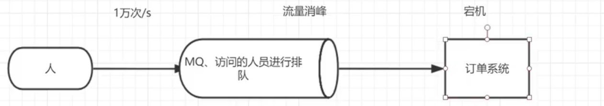

2. 应用解耦

   假设一个电商应用，应用中存在订单、库存、物流、支付等模块，如果耦合调用多个模块，其中任何一个子模块出现问题，就会导致下单操作异常

   这是就可以利用消息队列，例如此时出现问题的是物流系统，需要几分钟来修复，而这几分钟内，物流系统要处理的数据会被缓存在队列中，用户下单操作依然可以正常完成，提高熊的可用性

3. 异步处理

   某些服务间的调用是异步的，例如 A 调用 B，B 需要很长时间执行，但是 A 需要知道 B 什么时候执行完成

   这时就可以利用消息队列，当 A 调用 B 服务后. 只需要监听 B 处理后的信息，当 B 处理之后发送消息给 MQ ，MQ 会将此消息发送给 A 服务，A 再进行处理即可

   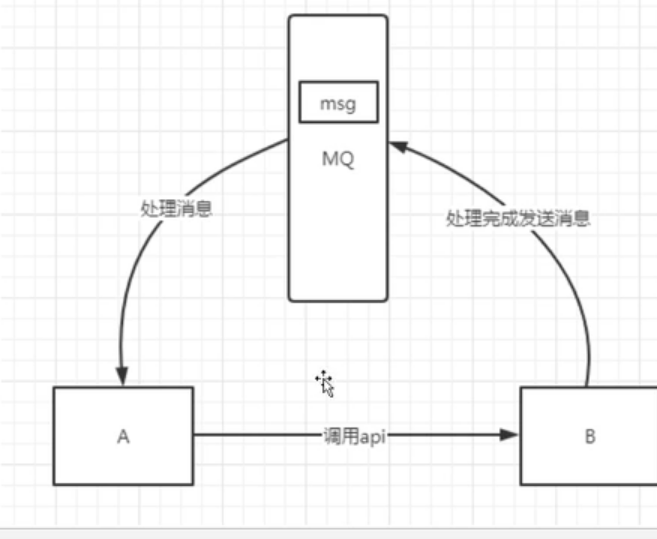

### 分类

1. ActiveMQ
   - 优点：单机吞吐量万级，时效性 ms 级，可用性高，基于**主从架构实现高可用性**，消息可靠性高，较低概率丢失数据
   - 缺点：维护少，高吞吐量场景较少
   
2. **Kafka**

   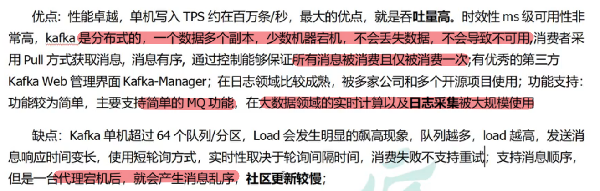

3. RocketMQ

   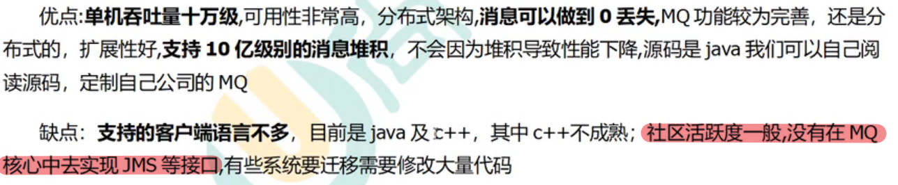

4. **RabbitMQ**

   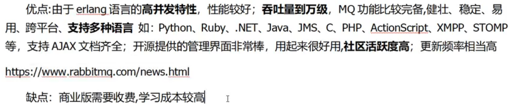

### 选择

1. Kafka - 数据量大，需求吞吐量高或者需要做 **日志采集** 功能，建议使用 Kafka
2. RocketMQ - 为金融互联网行业使用，对于要求可靠性较高的场景业务(订单，业务消峰等)，建议使用 RocketMQ
3. RabbitMQ - 结合 erlang 的场景下使用，性能好时效性高，社区活跃度也高，如果数据量不大，建议使用比较完备的 RabbitMQ

## 1.2 RabbitMQ 

> 主要做消息数据的接收，存储和转发

### 四大基本概念

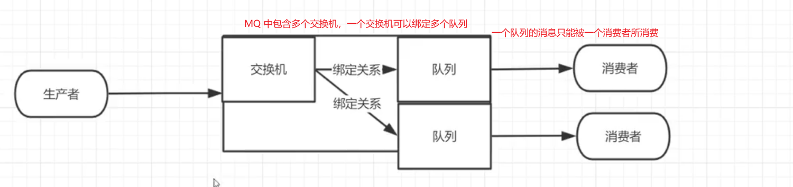

1. 生产者：生产数据并发送
2. 交换机：负责接收生产者的消息，另一方面将其推送到队列中，**消息的处理，都是由交换机决定的**
3. 队列：数据结构，负责存储消息，本质上就是一个大的消息缓存区，消费者中者其中获取消息
4. 消费者：接收数据并消费

### 六大模式

简单模式、工作模式、发布订阅模式、路由模式、主题模式、发布确认模式

### 名词解释

**RabbitMQ 工作原理：**

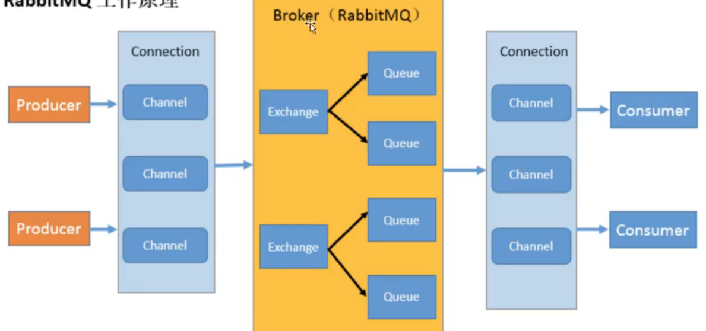

- Broker：一个 RabbitMQ Server

- Virtual host：出于多住户和安全因素设计，把 AMQP 的基本组件划分到一个虚拟的分组中。当多个不同的用户使用同一个 Broker 提供的服务时，可以在 Broker 内部划分出多个 vhost，**每个用户在自己的 vhost 创建 exchange/queue** 等

- Connection：publish /  consumer **和 broker 之间的 TCP 连接**

- Channel：

  由于建立的 Connection 的开销太大，所以使用内部的 Channel 作为**逻辑连接**。如果应用程序支持多线程，通常每个 thread 创建单独的 channel 进行通讯即可。

  AMQP method 包含了 channel id 帮助**客户端和 Broker 识别 channel** ，所以 channel 之间是完全隔离的，

  **channel 作为轻量级的 Connection 极大减少了操作熊建立 TCP 连接的开销**

- Exchange：消息达到 Broker 的第一站，根据不同的分发规则，查询表中的 routing key，将消息分发到不同的队列中去

  常用的规则有：direct、topic、fanout

- Queue：消息存储的地方，等待被取走

- Binding：**exchange 和 queue 之间**建立的虚拟连接，binding 中可以包含 routing key，Binding 的信息会被保存到 Exchange 中的查询表去，用于消息分发的依据

### 安装

1. RabbitMQ Github 下载地址：https://github.com/rabbitmq/rabbitmq-server/releases

   Elrang Github 下载地址：https://github.com/rabbitmq/erlang-rpm/releases

2. 下载对应的解压包到 Linux 中

3. 按照 Erlang 和需要的依赖

   ```shell
   rpm -ivh erlang-23.3.4.4-1.el7.x86_64.rpm
   yum install socat -y
   ```

4. 安装 RabbitMQ 

   ```shell
   rpm -ivh rabbitmq-server-3.8.17-1.el7.noarch.rpm
   ```

5. 启动并查看 RabbitMQ 服务

   ```shell
   systemctl start rabbitmq-server.service
   systemctl status rabbitmq-server.service
   ```

6. 设置成开机启动

   ```shell
   chkconfig rabbitmq-server on
   ```

7. 安装图形化插件

   ```shell
   rabbitmq-plugins enable rabbitmq_management
   ```

8. 重启 rabbitmq

   ```shel
   systemctl restart rabbitmq-server.service
   ```

9. 关闭防火墙后访问对应的 15672 端口

   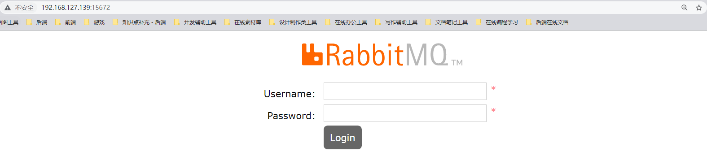

   账户密码默认是 guest，但由于不是 localhost，所以需要创建新用户授权后才可以访问

   

10. 创建新用户

    ```shell
    rabbitmqctl add_user {用户名} {密码} # 创建新用户
    rabbitmqctl set_user_tags {用户名} administrator # 添加角色
    rabbitmqctl set_permissions -p ”/“ {用户名} ”.*“ ".*" ".*" # 设置权限
    rabbitmqctl list_users # 查看所有用户和角色
    ```

    

11. 重新使用新账号登录

    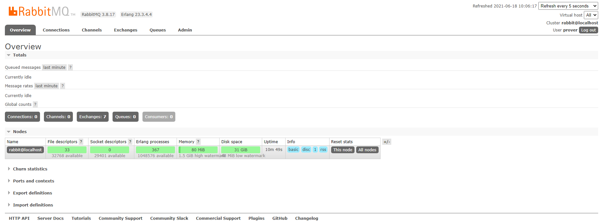

# 第二章 Hello World


1. 创建新模块 `01-hello-world`

2. 导入需要的依赖

   ```xml
   <dependencies>
       <dependency>
           <groupId>com.rabbitmq</groupId>
           <artifactId>amqp-client</artifactId>
           <version>5.12.0</version>
       </dependency>
       <dependency>
           <groupId>commons-io</groupId>
           <artifactId>commons-io</artifactId>
           <version>2.10.0</version>
       </dependency>
   </dependencies>
   
   <build>
       <plugins>
           <plugin>
               <groupId>org.apache.maven.plugins</groupId>
               <artifactId>maven-compiler-plugin</artifactId>
               <configuration>
                   <source>8</source>
                   <target>8</target>
               </configuration>
           </plugin>
       </plugins>
   </build>
   ```

3. 编写生产者代码

   ```java
   public class MessageProducer {
   
       // 定义队列名
       private static final String QUEUE_NAME = "hello";
       // 定义主机地址
       private static final String HOST = "192.168.127.139";
       // 定义连接 RabbitMQ Server 用户名
       private static final String USER_NAME = "prover";
       // 定义连接 RabbitMQ Server 密码
       private static final String PASSWORD = "123456";
   
       public static void main(String[] args) throws IOException, TimeoutException {
           // 创建一个连接工厂
           ConnectionFactory factory = new ConnectionFactory();
           // 设置主键地址，用户名和免密
           factory.setHost(HOST);
           factory.setUsername(USER_NAME);
           factory.setPassword(PASSWORD);
           // 创建连接
           Connection connection = factory.newConnection();
           // 获取信道(Conn 内部的逻辑连接)
           Channel channel = connection.createChannel();
           /* 创建队列
           *   1. 队列名
           *   2. 队列中的消息是否实现持久化，默认存储在内存中
           *   3. 队列是否进行消费共享, true 表示多个消费者共享，false 表示只供一个消费者消费
           *   4. 是否自动删除，最后一个消费者服务器断开连接后，是否自动删除该队列
           *   5. 自动删除
           * */
           channel.queueDeclare(QUEUE_NAME, false, false, false, null);
           // 定义消费信息
           String message = "hello world";
           /* 利用信道发送消息
           *   1. 交换机名，默认使用空字符串即可
           *   2. 路由 key，这里使用队列名即可
           *   3. 其他参数
           *   4. 消息
           * */
           channel.basicPublish("", QUEUE_NAME, null, message.getBytes());
           System.out.println("消息发送完毕");
       }
   
   }
   ```

4. 运行后查看管理界面

   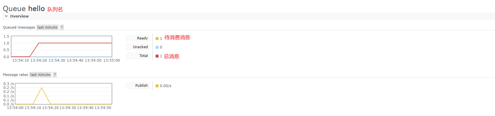

5. 编写消费者代码

   ```java
   public class MessageConsumer {
   
       // 定义队列名
       private static final String QUEUE_NAME = "hello";
       // 定义主机地址
       private static final String HOST = "192.168.127.139";
       // 定义连接 RabbitMQ Server 用户名
       private static final String USER_NAME = "prover";
       // 定义连接 RabbitMQ Server 密码
       private static final String PASSWORD = "123456";
   
       public static void main(String[] args) throws IOException, TimeoutException {
           // 创建一个连接工厂
           ConnectionFactory factory = new ConnectionFactory();
           // 设置主键地址，用户名和免密
           factory.setHost(HOST);
           factory.setUsername(USER_NAME);
           factory.setPassword(PASSWORD);
           // 创建连接
           Connection connection = factory.newConnection();
           // 获取通信(Conn 内部的逻辑连接)
           Channel channel = connection.createChannel();
           /* 通过通信获取消息
           *   1. 消息队列
           *   2. 消费成功后是否自动答应
           *   3. 消息送达时通知的回调接口
           *   4. 消费者取消消费的回调接口
           * */
           channel.basicConsume(QUEUE_NAME, true,
                   (consumerTag, message) -> System.out.println(consumerTag + ":" + new String(message.getBody())),
                   (consumerTag) -> System.out.println("消息消费失败:" + consumerTag)
           );
       }
   
   }
   ```

6. 运行，查看控制台打印的消息

   


# 第三章 Work Queue

> 当中间件中突然涌进大量任务(消息)时，为了能够快速的解决任务，就需要多个工作线程(消费者)使用根据一定的分发算法进行对应的任务
>
> 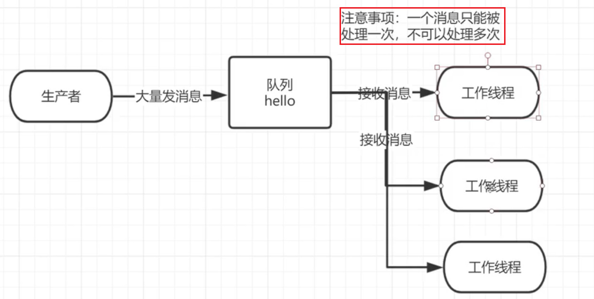

## 3.1 轮询分发消息

1. 创建工具类，将与 RabbitMQ 连接部分的代码抽取出来

   ```java
   public class RabbitmqUtil {
   
       // 定义队列名
       private static final String QUEUE_NAME = "hello";
       // 定义主机地址
       private static final String HOST = "192.168.127.139";
       // 定义连接 RabbitMQ Server 用户名
       private static final String USER_NAME = "prover";
       // 定义连接 RabbitMQ Server 密码
       private static final String PASSWORD = "123456";
   
       /**
        * 返回与 Rabbitmq Server 连接的 Channel 
        * @return
        * @throws IOException
        * @throws TimeoutException
        */
       public static Channel getChannel() throws IOException, TimeoutException {
           // 创建一个连接工厂
           ConnectionFactory factory = new ConnectionFactory();
           // 设置主键地址，用户名和免密
           factory.setHost(HOST);
           factory.setUsername(USER_NAME);
           factory.setPassword(PASSWORD);
           // 创建连接
           Connection connection = factory.newConnection();
           // 获取通信(Conn 内部的逻辑连接)
           return connection.createChannel();
       }
   
   }
   ```

2. 创建工作线程(消费者)

   ```java
   /**
    * @program: RabbitmqStudy
    * @description: 工作线程(消费者)
    * @author: EMTKnight
    * @create: 2021-06-21
    **/
   public class MessageWorker {
   
       // 定义队列名
       private static final String QUEUE_NAME = "hello";
   
       public static void main(String[] args) throws IOException, TimeoutException {
           Channel channel = RabbitmqUtil.getChannel();
           channel.basicConsume(QUEUE_NAME, true,
                   (consumerTag, message) -> System.out.println(consumerTag + ": 成功接收到消息 - " + new String(message.getBody())),
                   (consumerTag) -> System.out.println(consumerTag + ": 接收消息的过程中出现错误")
           );
       }
   
   }
   ```

   通过 IDEA 开启多个工作线程

   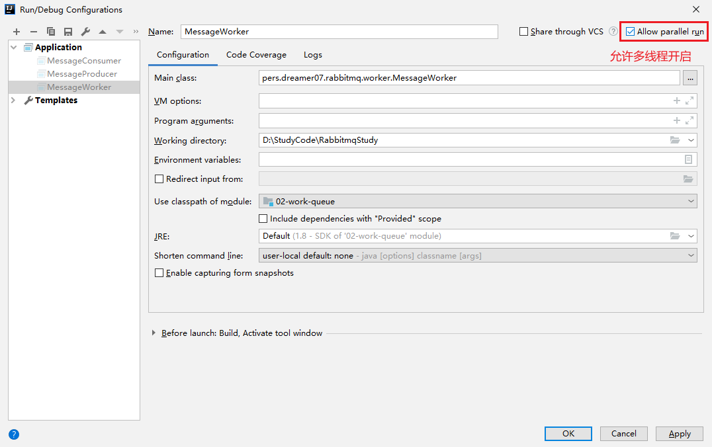

3. 编写生产者代码

   ```java
   /**
    * @program: RabbitmqStudy
    * @description: 消息生产者
    * @author: EMTKnight
    * @create: 2021-06-21
    **/
   
   public class MessageConsumer {
   
       // 定义队列名
       private static final String QUEUE_NAME = "hello";
   
       public static void main(String[] args) throws IOException, TimeoutException {
           // 获取信道
           Channel channel = RabbitmqUtil.getChannel();
           // 配置队列
           channel.queueDeclare(QUEUE_NAME, false, false, false, null);
           // 从控制台中接收消息
           Scanner scanner = new Scanner(System.in);
           while (scanner.hasNext()){
               // 获取消息
               String message = scanner.next();
               // 发送消息
               channel.basicPublish("", QUEUE_NAME, null, message.getBytes());
               System.out.println("消息发送成功:" + message);
           }
       }
   
   }
   ```

4. 启动，通过在生产者工作台输入消息，两个工作线程实现 **轮询消费**

## 3.2 消息应答

### 概念

默认情况下，rabbitmq 向消费者传递消息后，就会立即将该消息标记为删除。而为了保证消息能够被正常消费，避免由于消费者的宕机，出现异常等导致消息丢失，rabbitmq 引入了消息应答机制

在消费者将消息消费完之后，**告诉 rabbitmq 他已经处理了，此时 rabbitmq 再将该消息删除**

### 自动应答

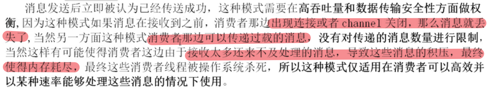

### 手动应答

#### 1) 批量应答

**支持批量应答(multiple)并且可以减少网络拥堵:** 开启批量应答的区别

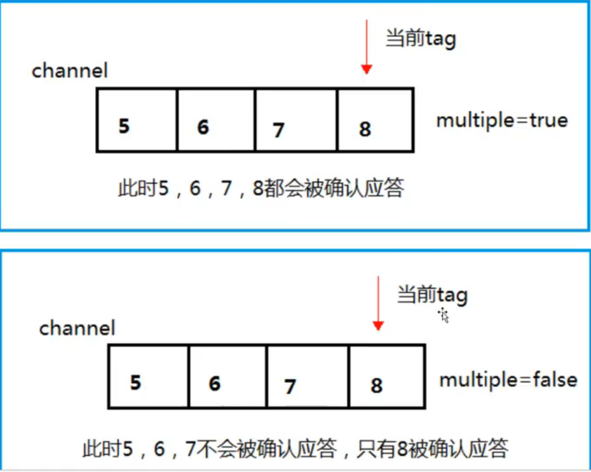

#### 2) 消息自动重新入队

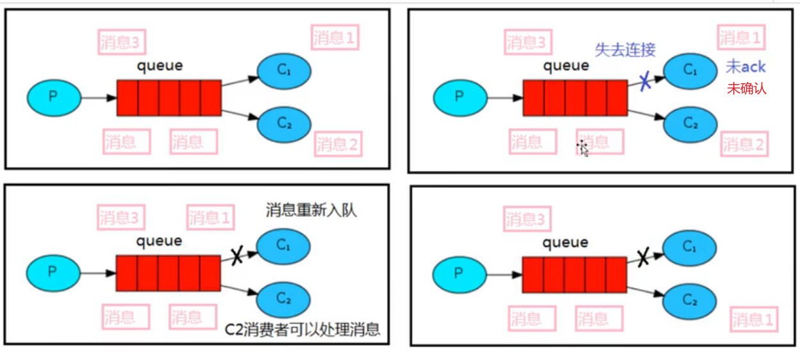

#### 3) 代码编写

1. 重新编写工作线程(消费者)代码

   ```java
   public class MessageAnswerWorker {
   
       // 定义队列名
       private static final String QUEUE_NAME = "hello";
   
       public static void main(String[] args) throws IOException, TimeoutException {
           Channel channel = RabbitmqUtil.getChannel();
           // 设置第二个参数取消自动应答
           channel.basicConsume(QUEUE_NAME, false,
                   (consumerTag, message) -> {
                       System.out.println(consumerTag + ": 成功接收到消息 - " + new String(message.getBody()));
                       // 模拟业务处理
                       try {
                           Thread.sleep(1000);
                       } catch (InterruptedException e) {
                           e.printStackTrace();
                       }
                       /*
                       * basicAck: 手动应答
                       *   - 第一个参数为消息表示
                       *   - 第二个参数为是否批量应答
                       * */
                       channel.basicAck(message.getEnvelope().getDeliveryTag(), false);
                   },
                   (consumerTag) -> System.out.println(consumerTag + ": 接收消息的过程中出现错误")
           );
       }
   }
   ```

   额外创建一个工作者线程，处理逻辑基本一致，只需要调整线程睡眠时间即可

   ```java
   Thread.sleep(10000);
   ```

2. 开启两个工作线程，如果第二个工作线程在处理(睡眠)的过程将其关闭，可以发现第一个工作线程会接收到处理失败的消息

   **避免了消息丢失**

   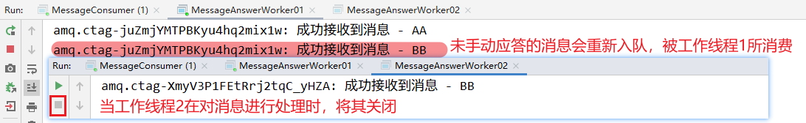

## 3.3 持久化

### 概念

通过消息应答，可以避免由于消费者的问题导致消息丢失。但又如何避免由于 RabbitMQ Server 宕机而导致生产者生产的消息丢失呢? -> **将队列和消息进行持久化**

### 队列持久化

> RabbitMQ 不支持通过 API 修改原队列，所以要先删除对应的队列

1. 在 RabbitMQ 的后台管理中删除测试队列

   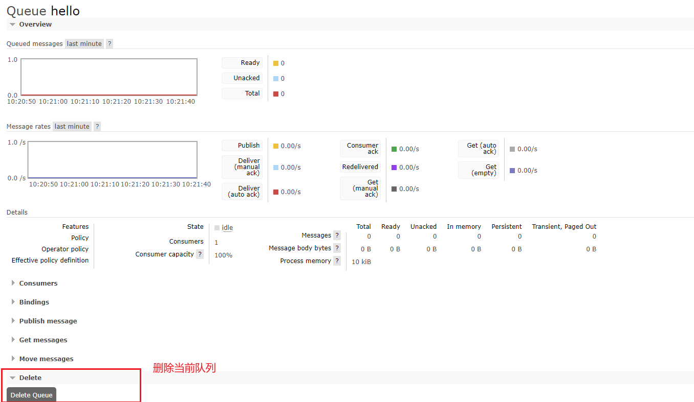

2. 修改任一生产者代码中的队列配置

   ```java
   // 第二个参数表示开启队列的持久化
   channel.queueDeclare(QUEUE_NAME, true, false, false, null);
   ```

3. 重启 RabbitMQ Server 查看队列

   

### 消息持久化

1. 添加任一生产者代码在发送消息时的配置

   ```java
   // 第二个参数设置为 MessageProperties.PERSISTENT_TEXT_PLAIN 标识该消息需要持久化到磁盘上
   channel.basicPublish("", QUEUE_NAME, MessageProperties.PERSISTENT_TEXT_PLAIN, message.getBytes());
   ```

2. 重启 MQ Server 查看队列中的消息

   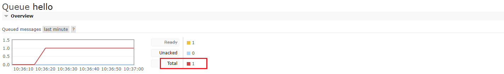

   注意：这里的持久化方式，依然可能导致数据丢失(数据在准备写入时宕机)，但概率较低

### 不公平分发 - 能者多劳

1. 修改带有线程睡眠的工作线程代码，配置不公平分发

   ```java
   // 设置不公平分发，默认是 0 (轮询分发)
   channel.basicQos(1);
   ```

2. 启动测试，生产 4 条消息

   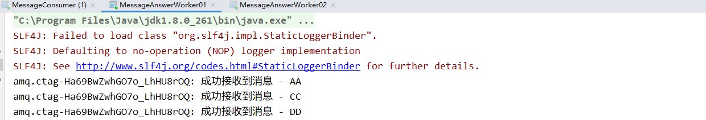

   其原理是通过设置 qos ，表示消费者每次最多只接收 n 条消息进行处理，只有将消息处理结束，手动应答之后，下一条消息才会被分发进来。

### 预取值

一个消费者连接的 Channel 是存在一个 **未确认的消息缓冲区**，可以通过**设置预取值限制缓冲区的大小**，避免缓存区中**存在太多未确认的消息**，直到有消息被确认 MQ Server 才会再发送消息到该 Channel

通常增加预取值将提高消费者传递消息的速度，可以在消费者中设置 `qos` 设置预取值

# 第四章 发布确认 

> 队列持久化 + 消息持久化 + 发布确认 => 保证消息的安全性

## 4.1 概念

生产者可以将 Channel 设置成 confirm 模式，此时所有在该 Channel 上发布的消息都会被指派一个唯一的 ID(从 1 开始)，当消息被投递到所有匹配的队列之后，Broker 就会发送一个确认信息给生产者(包含消息的唯一 ID)

如果消息和队列都是**可持久化**的，那么确认消息就会在消息写入磁盘后发出，回传的确认消息中的 delivery-tag 域包含了确认消息的序列号

confirm 是异步的，发布消息后，生产者可以在等待返回确认的同时继续发送下一条消息，当消息确认后，便通过回调方法来处理该确认信息。如果 Broker 因为自身原因导致消息丢失，就会发送一条 nack 消息，生产者可以在回调方法中处理该消息


## 4.1 确认

### 单个确认发布

一种简单的确认方式，同时也是一种**同步确认发布**(生产者必须等待它被确认发布才可以)的方式

缺点：**发布速度特别慢**

```java
/**
 * @program: RabbitmqStudy
 * @description: 测试单个发布确认 - 672
 * @author: EMTKnight
 * @create: 2021-06-21
 **/

public class SingleProducer {

    public static void main(String[] args) throws IOException, TimeoutException, InterruptedException {
        // 随机创建一个队列名
        String queueName = UUID.randomUUID().toString();
        // 获取通信
        Channel channel = RabbitmqUtil.getChannel();
        // 配置队列
        channel.queueDeclare(queueName, false, false, false , null);
        // 开启发布确认
        channel.confirmSelect();
        // 获取开始时间
        long start = System.currentTimeMillis();
        for (int i = 0; i < 1000; i++) {
            // 发布消息
            channel.basicPublish("", queueName, null, ("消息" + i).getBytes());
            // 等待发布确认
            boolean flag = channel.waitForConfirms();
            if (flag) {
                System.out.println("消息" + i + ": 成功发送");
            }
        }
        // 获取结束时间
        long end = System.currentTimeMillis();
        System.out.println("使用单个确认发布发送 1000 个消息，耗时:" + (end - start));
    }

}
```

### 批量确认发布

可以先发布一批消息后再一起确认，这样可以提高系统的吞吐量

缺点：

1. 如果出现异常，很难找出其中是哪一个出现异常，需要将整个批处理保存在内存中，以记录重要的信息而后重新发布消息
2. 这种方案也是同步的

```java
/**
 * @program: RabbitmqStudy
 * @description: 批量确认发布 - 109
 * @author: EMTKnight
 * @create: 2021-06-21
 **/

public class BatchProducer {

    public static void main(String[] args) throws IOException, TimeoutException, InterruptedException {
        // 随机创建一个队列名
        String queueName = UUID.randomUUID().toString();
        // 获取通信
        Channel channel = RabbitmqUtil.getChannel();
        // 配置队列
        channel.queueDeclare(queueName, false, false, false , null);
        // 开启发布确认
        channel.confirmSelect();
        // 获取开始时间
        long start = System.currentTimeMillis();

        for (int i = 1; i <= 1000; i++) {
            // 发布消息
            channel.basicPublish("", queueName, null, ("消息" + i).getBytes());
            // 发布确认
            if (i % 100 == 0) {
                boolean flag = channel.waitForConfirms();
                if (flag) {
                    System.out.println("批量发布确认成功");
                } else {
                    System.out.println("批量发布确认失败");
                }
            }
        }

        // 获取结束时间
        long end = System.currentTimeMillis();
        System.out.println("使用批量确认发布发送 1000 个消息，耗时:" + (end - start));
    }

}
```

### 异步确认发布

利用**回调函数**来达到消息可靠性传递，可靠性和效率都比前两种高  

缺点：编程逻辑复杂

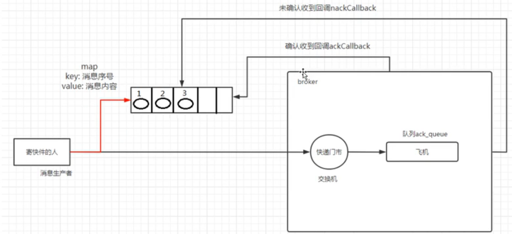

```java
/**
 * @program: RabbitmqStudy
 * @description: 异步发布确认 - 43
 * @author: EMTKnight
 * @create: 2021-06-21
 **/

public class AsyncProducer {

    public static void main(String[] args) throws IOException, TimeoutException {
        // 随机创建一个队列名
        String queueName = UUID.randomUUID().toString();
        // 获取通信
        Channel channel = RabbitmqUtil.getChannel();
        // 配置队列
        channel.queueDeclare(queueName, false, false, false , null);
        // 开启发布确认
        channel.confirmSelect();
        // 获取开始时间
        long start = System.currentTimeMillis();

        /*
        * 添加异步确认发布回调函数
        *   第一个参数为成功发布的回调函数
        *   第二个参数为发布失败的回调函数
        *   * 两个参数为同一个函数式接口的实现类
        *       - 第一个参数是消息的序列号(标识)
        *       - 第二个参数是消息是否为批量确认
        * */
        channel.addConfirmListener(
            (deliveryTag, nackCallback) -> System.out.println(deliveryTag + "消息发布确认成功"),
            (deliveryTag, nackCallback) -> System.out.println(deliveryTag + "消息发布确认失败")
        );

        for (int i = 1; i <= 1000; i++) {
            // 发布消息
            channel.basicPublish("", queueName, null, ("消息" + i).getBytes());
        }

        // 获取结束时间
        long end = System.currentTimeMillis();
        System.out.println("使用异步确认发布发送 1000 个消息，耗时:" + (end - start));
    }

}
```

### 处理异步未发送消息

可以将为确认的消息放在一个**同步容器**中(ConcurrentSkipListMap)，key 值保存对应的消息表示，value 保存对应的消息体

这个集合负责在 confirm cllback 和发布线程中工作

```java
public static void main(String[] args) throws IOException, TimeoutException {
    // 创建同步容器
    ConcurrentSkipListMap<Long, String> dataMap = new ConcurrentSkipListMap<>();
    ...

    /*
    * 添加异步确认发布回调函数
    *   第一个参数为成功发布的回调函数
    *   第二个参数为发布失败的回调函数
    *   * 两个参数为同一个函数式接口的实现类
    *       - 第一个参数是消息的序列号(标识)
    *       - 第二个参数是消息是否为批量确认
    * */
    channel.addConfirmListener(
        (deliveryTag, multiple) -> {
            // 判断是否为批量确认
            if (multiple) {
                dataMap.headMap(deliveryTag).clear();
            } else {
                // 从容器中删除对应的消息
                dataMap.headMap(deliveryTag);
            }
            System.out.println(deliveryTag + "消息发布确认成功");
        },
        (deliveryTag, multiple) -> {
            String message = dataMap.get(deliveryTag);
            System.out.println(deliveryTag + "消息发布确认失败, 具体的消息体为:" + message);
        }
    );

    for (int i = 1; i <= 1000; i++) {
        // 发布消息
        channel.basicPublish("", queueName, null, ("消息" + i).getBytes());
        // 将消息和对应的序列号保存到容器中
        dataMap.put(channel.getNextPublishSeqNo(), ("消息" + i));
    }

    ...
}
```

# 第五章 交换机

用于实现**订阅/发布模式**:

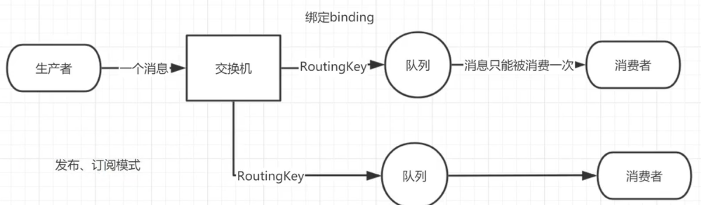

## 5.1 Exchange

### 概念

RabbitMQ 消息传递模型的核心就是：**生产者生产的消息从不会直接发送到队列上**，而是发送消息到交换机中

交换机负责从生产者中接收消息，再根据相应的规则(放在特定队列/广播/丢弃等)推入到对应的队列中


### 类型

- 直接(路由类型)
- 主题
- 扇出(发布/订阅类型)
- ~~标题~~(不常用)
- 无名(默认)

## 5.2 临时队列 - 自动删除队列

当对应的所有消费者都断开连接后，该队列就会自动删除

```java
channel.queueDeclard.getQueue(); //获取临时队列
```

## 5.3 绑定

负责维护 exchange 和 queue 之间的桥梁，由其来决定 exchange 与哪些 queue 进行了绑定


## 5.4 Fanout - 扇出(发布/订阅)

### 简介

可以将接受到的所有消息**广播**到所有关联的队列中，在该模式中队列和交换机的 routingKey 应该都是一样的

### 实战

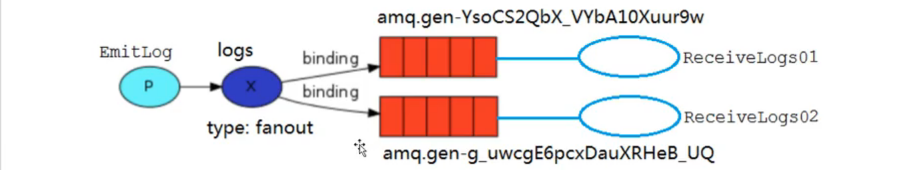

1. 编写消费者，多线程开启

   ```java
   /**
    * @program: RabbitmqStudy
    * @description: 基于 fanout 交换机模式的消费者
    * @author: EMTKnight
    * @create: 2021-06-21
    **/
   
   public class FanoutExchangeConsumer {
   
       private final static String FANOUT_EXCHANGE_NAME = "logs";
   
       public static void main(String[] args) throws IOException, TimeoutException {
           // 获取连接
           Channel channel = RabbitmqUtil.getChannel();
           // 声明交换机
           channel.exchangeDeclare(FANOUT_EXCHANGE_NAME, BuiltinExchangeType.FANOUT);
           // 声明临时队列
           String queueName = channel.queueDeclare().getQueue();
           /* 将交换机和路由进行绑定
           *   - 第一个参数为队列名
           *   - 第二个参数为交换机名
           *   - 第三个参数为维护关系的路由 key
           * */
           channel.queueBind(queueName, FANOUT_EXCHANGE_NAME, "");
           System.out.println("正在等待新消息的到来....");
   
           // 接收消息
           channel.basicConsume(queueName, true,
               (consumerTag, message) -> System.out.println("成功接收到消息:" + new String(message.getBody())),
               (consumerTag) -> System.out.println("没有成功接收到消息:" + consumerTag)
           );
       }
   
   }
   ```

2. 编写生产者，负责发布消息

   ```java
   public class FanoutExchangeProducer {
   
       private final static String FANOUT_EXCHANGE_NAME = "logs";
   
       public static void main(String[] args) throws IOException, TimeoutException {
           // 获取通信
           Channel channel = RabbitmqUtil.getChannel();
   
           Scanner scanner = new Scanner(System.in);
           while (scanner.hasNext()) {
               String message = scanner.next();
               // 通过交换机'发布'消息
               channel.basicPublish(FANOUT_EXCHANGE_NAME, "", null, message.getBytes());
               System.out.println("成功发布消息:" + message);
           }
   
       }
   
   }
   ```

3. 启动，实现 **发布/订阅**(生产者发布一条消息，所有相关队列的消费者接受到该消息)

## 5.5 Direct - 路由模式

### 简介

fanout 模式并不支持灵活的操作，只能进行无意识的广播，而 direct 模式支持将消息传递给指定 routingKey 的队列中

如果发布消息的 routingKey 并不存在该交换机中，该**消息就会被丢弃**

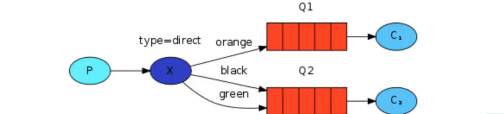

### 多重绑定


在 direct 类型的交换机中，允许使用相同的 routingKey 绑定多个队列，就和 fanout 差不多	

### 实战

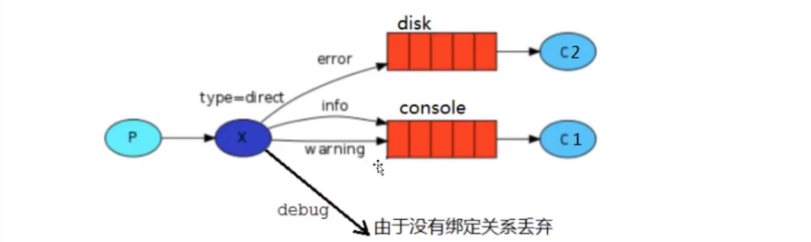

1. 创建针对两个队列的消费者

   ```java
   /**
    * @program: RabbitmqStudy
    * @description: 基于 direct 交换机模式 console 队列的消费者
    * @author: EMTKnight
    * @create: 2021-06-21
    **/
   
   public class ConsoleQueueConsumer {
   
       private final static String DIRECT_EXCHANGE_NAME = "direct_logs";
   
       public static void main(String[] args) throws IOException, TimeoutException {
           // 获取通信
           Channel channel = RabbitmqUtil.getChannel();
           // 配置交换机
           channel.exchangeDeclare(DIRECT_EXCHANGE_NAME, BuiltinExchangeType.DIRECT);
           // 配置队列
           channel.queueDeclare("console", false, false, false, null);
           // 绑定队列和交换机
           channel.queueBind("console", DIRECT_EXCHANGE_NAME, "info");
           channel.queueBind("console", DIRECT_EXCHANGE_NAME, "warning");
           System.out.println("正在等待新消息的到来....");
   
           // 接收消息
           channel.basicConsume("console", true,
                   (consumerTag, message) -> System.out.println("console --> 成功接收到消息:" + new String(message.getBody())),
                   (consumerTag) -> System.out.println("console --> 没有成功接收到消息:" + consumerTag)
           );
       }
   
   }
   ```
   
   ```java
   /**
    * @program: RabbitmqStudy
    * @description: 基于 direct 交换机模式 disk 队列的消费者
    * @author: EMTKnight
    * @create: 2021-06-21
    **/
   
   public class DiskQueueConsumer {
   
       private final static String DIRECT_EXCHANGE_NAME = "direct_logs";
   
       public static void main(String[] args) throws IOException, TimeoutException {
           // 获取通信
           Channel channel = RabbitmqUtil.getChannel();
           // 配置队列
           channel.queueDeclare("disk", false, false, false, null);
           // 绑定队列和交换机
           channel.queueBind("disk", DIRECT_EXCHANGE_NAME, "error");
           System.out.println("正在等待新消息的到来....");
   
           // 接收消息
           channel.basicConsume("disk", true,
                   (consumerTag, message) -> System.out.println("disk --> 成功接收到消息:" + new String(message.getBody())),
                   (consumerTag) -> System.out.println("disk --> 没有成功接收到消息:" + consumerTag)
           );
       }
   
   }
   ```
   
2. 创建一个消息生产者

   ```java
   public class MessageProducer {
   
       private final static String DIRECT_EXCHANGE_NAME = "direct_logs";
   
       public static void main(String[] args) throws IOException, TimeoutException {
           // 获取通信
           Channel channel = RabbitmqUtil.getChannel();
   
           Scanner sc = new Scanner(System.in);
           System.out.println("输入要发送队列的 routingKey(info/warning/error)");
           // 获取要发送队列的 routingKey
           String routingKey = sc.next();
           while (sc.hasNext()) {
               String message = sc.next();
               channel.basicPublish(DIRECT_EXCHANGE_NAME, routingKey, null, message.getBytes());
               System.out.println("成功发送消息:" + message);
           }
       }
   }
   ```

3. 启动，输入对应的 routingKey 和 message，并查看对应消费者的控制台(消息只会发送给对应 routingKey 的队列)

## 5.6 Topic - 交换机模式

### 概念

和 Direct 模式原理相同，都是根据路由匹配队列，但比其更加强大的是 **支持 routingKey 的模糊匹配**

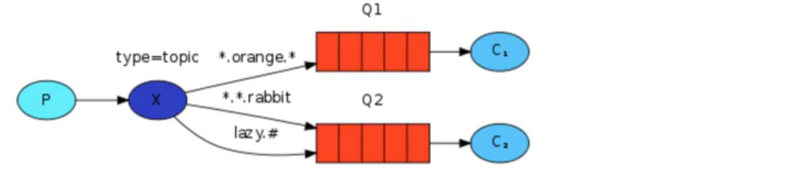

> \* 表示任意一个单词，\# 表示零个/多个单词

如果队列的路由键为 #，那么这个队列就能接收所有数据，类似于 **fanout** 模式

如果队列的路由键不包含 #/*, 就类似于 **direct** 模式

### 实战

1. 创建两个消费者

   ```java
   /**
    * @program: RabbitmqStudy
    * @description: 基于 topic 交换机模式的 Q1 队列的消费者
    * @author: EMTKnight
    * @create: 2021-06-22
    **/
   
   public class Q1Consumer {
   
       private final static String TOPIC_EXCHANGE_NAME = "topic_logs";
   
       public static void main(String[] args) throws IOException, TimeoutException {
           // 获取通信
           Channel channel = RabbitmqUtil.getChannel();
           // 配置交换机
           channel.exchangeDeclare(TOPIC_EXCHANGE_NAME, BuiltinExchangeType.TOPIC, false, false, null);
           // 配置队列
           channel.queueDeclare("Q1", false, false, false, null);
           // 绑定队列和交换机
           channel.queueBind("Q1", TOPIC_EXCHANGE_NAME, "*.orange.*");
           // 等待接收消息
           channel.basicConsume("Q1", true,
                   (consumerTag, message) -> {
                       System.out.println("Q1 队列中获取信息: " + message + "，对应的 routingKey 为:" + message.getEnvelope().getRoutingKey());
                   },
                   (consumerTag) -> System.out.println("console --> 没有成功接收到消息:" + consumerTag)
           );
       }
   
   }
   ```

   ```java
   /**
    * @program: RabbitmqStudy
    * @description: 基于 topic 交换机模式的 Q2 队列的消费者
    * @author: EMTKnight
    * @create: 2021-06-22
    **/
   
   public class Q2Consumer {
   
       private final static String TOPIC_EXCHANGE_NAME = "topic_logs";
   
       public static void main(String[] args) throws IOException, TimeoutException {
           // 获取通信
           Channel channel = RabbitmqUtil.getChannel();
           // 配置队列
           channel.queueDeclare("Q2", false, false, false, null);
           // 绑定队列和交换机
           channel.queueBind("Q2", TOPIC_EXCHANGE_NAME, "*.*.rabbit");
           channel.queueBind("Q2", TOPIC_EXCHANGE_NAME, "lazy.#");
           // 等待接收消息
           channel.basicConsume("Q1", true,
                   (consumerTag, message) -> {
                       System.out.println("Q2 队列中获取信息: " + message + "，对应的 routingKey 为:" + message.getEnvelope().getRoutingKey());
                   },
                   (consumerTag) -> System.out.println("console --> 没有成功接收到消息:" + consumerTag)
           );
       }
   
   }
   ```

2. 创建生产者

   ```java
   /**
    * @program: RabbitmqStudy
    * @description: 消息生产者
    * @author: EMTKnight
    * @create: 2021-06-22
    **/
   
   public class MessageProducer {
   
       private final static String TOPIC_EXCHANGE_NAME = "topic_logs";
   
       public static void main(String[] args) throws IOException, TimeoutException {
           // 获取通信
           Channel channel = RabbitmqUtil.getChannel();
           Scanner scanner = new Scanner(System.in);
           while (true) {
               System.out.print("请输入要发送消息队列的 routingKey:");
               String routingKey = scanner.next();
               System.out.print("请输入要发送的消息体:");
               String message = scanner.next();
               channel.basicPublish(TOPIC_EXCHANGE_NAME, routingKey, null, message.getBytes());
               System.out.println("成功发送消息:" + message + ", 使用的 routingKey:" + routingKey);
           }
       }
   
   }
   ```

3. 启动，输入对应的 routing 和 message 后查看对应消费者的控制台

# 第六章 死信队列

## 6.1 概念

一般来说，`producer` 将消息投递到 broker / queue 中，consumer 从队列中取出消息进行消费，但某些时候由于特定的原因**导致 queue 中的某些消息无法被消费**，这样的消息如果没有后续处理，就变成了死信，所以自然就有了死信队列

应用场景：

1. 为了保证订单业务的消息不会丢失，当订单信息发生异常时，将消息投入到死信队列中，防止消息消逝
2. 用户在下单后未能在一定时间内支付时自动失效 

## 6.2 来源

1. 消息 TTL(存活时间) 过期
2. 队列达到了最大长度(队列满了，无法再添加数据到 mq 中)
3. 消息被拒绝并且不能返回队列中

## 6.3 实战

### 代码架构图

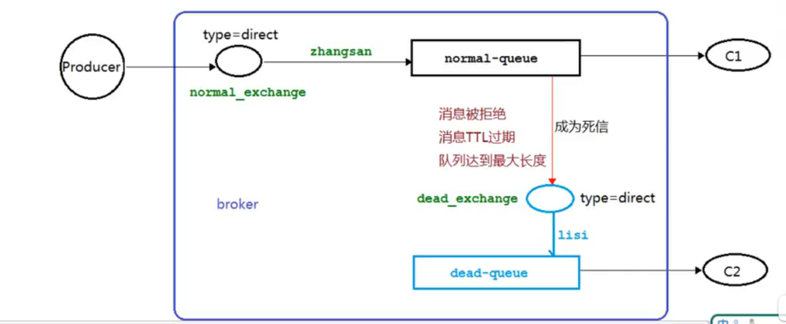

### 编码 - TTL 过期

> 关于队列的一些额外配置，可以参考: https://my.oschina.net/LucasZhu/blog/1838169

1. 编写消息消费者和死信消息消费者

   ```java
   /**
    * @program: RabbitmqStudy
    * @description: 死信消息消费者
    * @author: EMTKnight
    * @create: 2021-06-22
    **/
   
   public class DeadLetterMessageConsumer {
   
       private final static String DEAD_LETTER_EXCHANGE_NAME = "dead_exchange";
       private final static String DEAD_QUEUE = "dead-queue";
       private static Channel channel;
   
       static {
           // 获取信道
           try {
               channel = RabbitmqUtil.getChannel();
               // 声明交换机
               channel.exchangeDeclare(DEAD_LETTER_EXCHANGE_NAME, BuiltinExchangeType.DIRECT);
               // 声明队列
               channel.queueDeclare(DEAD_QUEUE, false, false, false, null);
               // 绑定队列和交换机
               channel.queueBind(DEAD_QUEUE, DEAD_LETTER_EXCHANGE_NAME, "dead.letter");
           } catch (IOException | TimeoutException e) {
               e.printStackTrace();
           }
       }
   
       public static void main(String[] args) throws IOException {
           System.out.println("等待死信消息.....");
           channel.basicConsume(DEAD_QUEUE, true,
                   (tag, message) -> System.out.println(DEAD_QUEUE + "处理死信消息:" + new String(message.getBody())),
                   (message) -> {}
           );
       }
   }
   
   ```

   消息消费者

   ```java
   /**
    * @program: RabbitmqStudy
    * @description: 消息消费者
    * @author: EMTKnight
    * @create: 2021-06-22
    **/
   
   public class MessageConsumer {
   
       private final static String DEAD_LETTER_EXCHANGE_NAME = "dead_exchange";
   
       private final static String NORMAL_EXCHANGE_NAME = "normal_exchange";
       private final static String NORMAL_QUEUE_NAME = "normal_queue";
       private static Channel channel;
   
       static {
           // 获取通信
           try {
               channel = RabbitmqUtil.getChannel();
               // 配置交换机
               channel.exchangeDeclare(NORMAL_EXCHANGE_NAME, BuiltinExchangeType.DIRECT);
               // 配置队列
               channel.queueDeclare(NORMAL_QUEUE_NAME, false, false, false, new HashMap<String,Object>(){{
                   // 配置队列参数
                   // 1. 配置死信交换机
                   put("x-dead-letter-exchange", DEAD_LETTER_EXCHANGE_NAME);
                   // 2. 配置死信交换队列的路由 key
                   put("x-dead-letter-routing-key", "dead.letter");
                   // 3. [可选] 配置消息 TTL(存活时间，也可以由客户端指定) ms
   //            put("x-message-ttl", 10000);
               }});
               // 绑定队列和交换机
               channel.queueBind(NORMAL_QUEUE_NAME, NORMAL_EXCHANGE_NAME, "normal.queue");
           } catch (IOException | TimeoutException e) {
               e.printStackTrace();
           }
       }
   
       public static void main(String[] args) throws IOException {
           System.out.println("等待消息....");
           channel.basicConsume(NORMAL_QUEUE_NAME, true,
                   (tag, message) -> System.out.println(NORMAL_QUEUE_NAME + "处理消息:" + new String(message.getBody())),
                   (message) -> {}
           );
       }
   }
   ```

2. 编写生产者代码

   ```java
   /**
    * @program: RabbitmqStudy
    * @description: 消息生产者
    * @author: EMTKnight
    * @create: 2021-06-22
    **/
   
   public class MessageProducer {
   
       private final static String NORMAL_EXCHANGE_NAME = "normal_exchange";
   
       public static void main(String[] args) throws IOException, TimeoutException {
           // 获取通信
           Channel channel = RabbitmqUtil.getChannel();
           for (int i = 0; i < 10; i++) {
               String message = i + "";
               // 向交换机中发送消息
               channel.basicPublish(NORMAL_EXCHANGE_NAME, "",
                       // 对消息的过期时间进行配置(单位: ms)
                       new AMQP.BasicProperties().builder().expiration("10000").build(),
                       message.getBytes()
               );
           }
   
       }
   
   }
   ```

3. 启动消息生产者前，关闭消费者，查看 Queue 的状况

   

   等待 10 秒钟, 可以发现由于消息超时都被转发到了死信队列中

   

4. 开启死信消费者，查看控制台打印

### 队列达到最大长度

1. 为了正常模拟，应该删除原队列，同时注释掉 TTL 参数的配置

2. 修改 `normal_queue` 队列的配置，限制队列内消息最大数量

   ```java
   // 配置队列
   channel.queueDeclare(NORMAL_QUEUE_NAME, false, false, false, new HashMap<String,Object>(){{
       ...
       // 4. [模拟队列达到最大长度] 配置队列内消息最大个数
       put("x-max-length",6);
   }});
   ```

3. 重启，测试(为了模拟消费者启动后即可关闭)

4. 查看 RabbitMQ 后台管理

   

### 拒绝处理

1. 为了正常模拟，应该删除原队列，同时注释掉 TTL 参数和队列最大长度的配置

2. 修改 `normal_queue` 队列的配置

   ```java
   // 测试拒绝处理指定消息并且不重新加入到消息队列中, 关闭自动应答
   channel.basicConsume(NORMAL_QUEUE_NAME, false,
   	(tag, message) -> {
           String msg = new String(message.getBody());
           // 判断字符串
           if ("5".equals(msg)) {
               System.out.println(NORMAL_QUEUE_NAME + "拒绝处理消息:" + new String(message.getBody()));
               // 拒绝处理消息，第二个参数设置为 false 表示不重新返回消息队列中(但可以被转发到死信队列中)
               channel.basicReject(message.getEnvelope().getDeliveryTag(), false);
           } else {
               System.out.println(NORMAL_QUEUE_NAME + "处理消息:" + new String(message.getBody()));
               // 手动应答
               channel.basicAck(message.getEnvelope().getDeliveryTag(), false);
           }
       },
   	(message) -> {}
   );
   ```

   注意需要设置手动应答

3. 重启，测试，查看控制台打印

   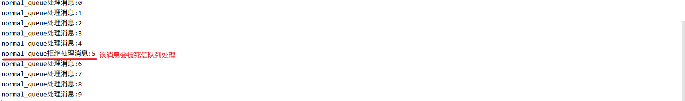

# 第七章 延迟队列

## 7.1 简介

延迟队列中的消息是需要在**指定时间达到之后/之前**取出和处理的，简单理解就是，延迟队列就是存储需要在指定时间内被处理的消息的队列

RabbitMQ 中并没有直接提供延迟队列，但可以利用**消息的生存时间**和**死信队列**实现延时(消息过期转入死信队列，实现延迟队列)

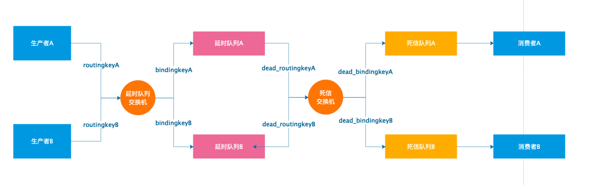

## 7.2 使用场景

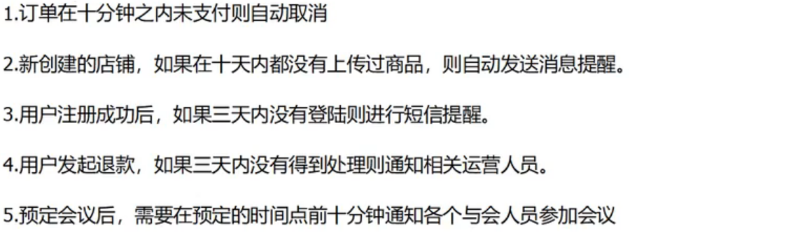

这些场景都有一个特点，需要在某个事件发生之后或者之前的指定时间点完成某一项任务，看起来似乎使用定时任务，一直轮询数据，每秒查一次，取出需要被处理的数据，然后处理不就完事了吗？如果数据量比较少，确实可以这样做，

比如：对于“如果账单一周内未支付则进行自动结算”这样的需求，如果对于时间不是严格限制，而是宽松意义上的一周，那么每天晚上跑个定时任务检查一下所有未支付的账单，确实也是一个可行的方案。

但对于数据量比较大，并且时效性较强的场景，如：“订单十分钟内未支付则关闭“，短期内未支付的订单数据可能会有很多，活动期间甚至会达到百万甚至千万级别，对这么庞大的数据量仍旧使用轮询的方式显然是不可取的，很可能在一秒内无法完成所有订单的检查，同时会给数据库带来很大压力，无法满足业务要求而且性能低下。

## 7.3 TTL

### 简介

RabbitMQ 中一个消息/队列的属性，表明一个消息/一个队列中的所有消息最大存活时间(单位是毫秒)

额如果没有在 TTL 规定的时间内被消费就会成为**死信**。

如果同时配置了队列的TTL 和消息的TTL，那么**较小的那个值**将会被使用，

### 区别

1. 如果**队列**中设置了 TTL，如果消息过期就会被丢弃(如果配置了死信队列就会转移到死信队列中)

   如果**消息**设置了  TTL，消息过期后不一定立刻丢弃，因为**消息是否过期是在即将投递到消费者之前判定的**

2. 如果**不设置 TTL**，表示消息永远不会过期，如果将 TTL 设置为 0，则表示除非此时可以

   直接投递该消息到消费者，否则该消息将会被丢弃。

> 这里会存在一个==问题==: 当 TTL 较长的消息进入队列后，TTL 较短的消息也进入，此时后者并不会快于前者进入死信队列，因为 RabbitMQ 是**按照顺序**的且 **消息是否过期是在即将投递到消费者之前判定的**

## 7.4 实战

### 整合 SpringBoot

1. 创建新模块，继承 SpringBoot

2. 修改 POM，导入需要的依赖

   ```xml
   <dependencies>
       <!--RabbitMQ 依赖-->
       <dependency>
           <groupId>org.springframework.boot</groupId>
           <artifactId>spring-boot-starter-amqp</artifactId>
       </dependency>
       <dependency>
           <groupId>org.springframework.boot</groupId>
           <artifactId>spring-boot-starter-web</artifactId>
       </dependency>
       <dependency>
           <groupId>org.springframework.boot</groupId>
           <artifactId>spring-boot-starter-test</artifactId>
           <scope>test</scope>
       </dependency>
       <dependency>
           <groupId>com.alibaba</groupId>
           <artifactId>fastjson</artifactId>
           <version>1.2.47</version>
       </dependency>
       <dependency>
           <groupId>org.projectlombok</groupId>
           <artifactId>lombok</artifactId>
       </dependency>
       <!-- 添加 Swagger 依赖 -->
       <dependency>
           <groupId>io.springfox</groupId>
           <artifactId>springfox-boot-starter</artifactId>
           <version>3.0.0</version>
       </dependency>
       <!--RabbitMQ 测试依赖-->
       <dependency>
           <groupId>org.springframework.amqp</groupId>
           <artifactId>spring-rabbit-test</artifactId>
           <scope>test</scope>
       </dependency>
   </dependencies>
   ```

3. 编写配置文件

   ```properties
   # 配置 Rabbit MQ 的连接
   spring.rabbitmq.addresses=192.168.127.139
   spring.rabbitmq.port=5672
   spring.rabbitmq.username=prover
   spring.rabbitmq.password=123456
   ```

4. 创建 Swagger 配置类

   ```java
   @Configuration
   public class SwaggerConfig {
   
       @Bean
       public Docket docket(){
           return new Docket(DocumentationType.OAS_30)
               .apiInfo(apiInfo()).groupName("06-delay-queue");
       }
   
       /**
        * 配置 API 接口文档信息
        * @return
        */
       private ApiInfo apiInfo() {
           return new ApiInfo(
               "SpringBoot 整合 RabbitMQ",
               "通过 Swagger 提供 API 接口实现对延迟队列的测试",
               "1.0",
               "http://www.baidu.com", // 网址?
               new Contact("Prover", "http://www.baidu.com", "111222@qq.com"),
               "Apache 2.0",
               "http://www.apache.org/licenses/LICENSE-2.0",
               new ArrayList<>()
           );
       }
   
   }
   ```

5. 在主启动类上添加 `@EnableOpenApi`

### 代码架构图

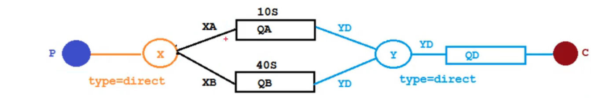

### 编码

#### 1) 配置交换机,队列

1. 定义配置 RabbitMQ 组件会使用的常量(队列名，交换机名，routingKey 等)

   ```java
   public class RabbitConstant {
   
       //---------- 交换机
       /**
        * 正常交换机名称
        */
       public static final String EXCHANGE_DIRECT_NORMAL_X = "X";
   
       /**
        * 死信交换机
        */
       public static final String EXCHANGE_DIRECT_DEAD_LETTER_Y = "Y";
   
       //---------- 队列
       /**
        * 正常队列 QA
        */
       public static final String QUEUE_NORMAL_QA = "QA";
   
       /**
        * 正常队列 QB
        */
       public static final String QUEUE_NORMAL_QB = "QB";
   
       /**
        * 死信队列 QD
        */
       public static final String QUEUE_DEAD_LETTER_QD = "QD";
   
   
       //---------- routingKey
       /**
        * 维护队列 QA&QB 和 X 交换机之间的 routingKey
        */
       public static final String QA_X = "XA";
       public static final String QB_X = "XB";
       /**
        * 维护队列 QD 和 Y 交换机之间的 routingKey
        */
       public static final String QD_Y = "YD";
   
   }
   ```

2. 创建配置类，配置交换机、队列及其之间的 routingKey

   ```java
   /**
    * @program: RabbitmqStudy
    * @description: 配置 RabbitMQ 组件
    * @author: EMTKnight
    * @create: 2021-06-22
    **/
   @Configuration
   public class RabbitComponentConfig {
   
       /**
        * 配置正常交换机
        * @return
        */
       @Bean
       public DirectExchange xExchange(){
           return new DirectExchange(RabbitConstant.EXCHANGE_DIRECT_NORMAL_X);
       }
   
       /**
        * 配置死信交换机
        * @return
        */
       @Bean
       public DirectExchange yExchange(){
           return new DirectExchange(RabbitConstant.EXCHANGE_DIRECT_DEAD_LETTER_Y);
       }
   
       /**
        * 配置正常队列 QA
        * @return
        */
       @Bean("QA")
       public Queue qa(){
           return QueueBuilder.durable(RabbitConstant.QUEUE_NORMAL_QA)
               // 配置死信交换机
               .deadLetterExchange(RabbitConstant.EXCHANGE_DIRECT_DEAD_LETTER_Y)
               // 配置死信交换机与死信队列的 routingKey
               .deadLetterRoutingKey(RabbitConstant.ROUTING_KEY_QD_Y)
               // 配置消息 TTL(ms)
               .ttl(10000)
               .build();
       }
   
       /**
        * 配置正常队列 QB
        * @return
        */
       @Bean("QB")
       public Queue qb(){
           return QueueBuilder.durable(RabbitConstant.QUEUE_NORMAL_QB)
               // 配置死信交换机
               .deadLetterExchange(RabbitConstant.EXCHANGE_DIRECT_DEAD_LETTER_Y)
               // 配置死信交换机与死信队列的 routingKey
               .deadLetterRoutingKey(RabbitConstant.ROUTING_KEY_QD_Y)
               // 配置消息 TTL(ms)
               .ttl(40000)
               .build();
       }
   
       /**
        * 配置死信队列 QD
        * @return
        */
       @Bean("QD")
       public Queue qd(){
           return QueueBuilder.durable(RabbitConstant.QUEUE_DEAD_LETTER_QD).build();
       }
   
       /**
        * 配置 QA 队列和 X 交换机的绑定关系
        */
       @Bean
       public Binding qaToX(){
           return BindingBuilder.bind(qa()).to(xExchange()).with(RabbitConstant.ROUTING_KEY_QA_X);
       }
   
       /**
        * 配置 QB 队列和 X 交换机的绑定关系
        */
       @Bean
       public Binding qbToX(){
           return BindingBuilder.bind(qb()).to(xExchange()).with(RabbitConstant.ROUTING_KEY_QB_X);
       }
   
       /**
        * 配置 QD 队列和 Y 交换机的绑定关系
        */
       @Bean
       public Binding qdToY(){
           return BindingBuilder.bind(qd()).to(yExchange()).with(RabbitConstant.ROUTING_KEY_QD_Y);
       }
   }
   ```

####  2) 编写消费者

```java
/**
 * @program: RabbitmqStudy
 * @description: 消息消费者
 * @author: EMTKnight
 * @create: 2021-06-22
 **/
@Component
@Slf4j
public class MessageConsumer {

    /**
     * 监听死信队列 QD 中的消息
     * @param message 消息体
     * @param channel 信道
     */
    @RabbitListener(queues = RabbitConstant.QUEUE_DEAD_LETTER_QD)
    public void receiveQD(Message message, Channel channel){
        log.info("死信队列 {}, 收到死信消息为: {}", RabbitConstant.QUEUE_DEAD_LETTER_QD, new String(message.getBody()));
    }

}
```

#### 3) 编写生产者(控制器)

```java
/**
 * @program: RabbitmqStudy
 * @description: 消息生产者(控制器)
 * @author: EMTKnight
 * @create: 2021-06-22
 **/
@RestController
@RequestMapping("/msg")
public class MessageController {

    @Autowired
    private RabbitTemplate rabbitTemplate;

    /**
     * 发送消息
     * @param message
     */
    @GetMapping("/send/{message}")
    public void sendMsg(@PathVariable String message){
        // 通过 Spring 整合的操作类 rabbitTemplate 实现消息发布
        rabbitTemplate.convertAndSend(
                RabbitConstant.EXCHANGE_DIRECT_NORMAL_X, RabbitConstant.ROUTING_KEY_QA_X, "来自队列 QA 的消息:" + message);
        rabbitTemplate.convertAndSend(
                RabbitConstant.EXCHANGE_DIRECT_NORMAL_X, RabbitConstant.ROUTING_KEY_QB_X, "来自队列 QB 的消息:" + message);
    }

}
```

启动，访问 http://localhost:8080/msg/send/byqtxdy 后查看控制台打印


## 7.5 优化

> 避免一个队列一个 TTL，应该是一个队列支持多个 TTL

1. 新增两个常量

   ```java
   /**
   * 正常队列 QC
   */
   public static final String QUEUE_NORMAL_QC = "QC";
   public static final String ROUTING_KEY_QC_X = "XC";
   ```

2. 添加新的配置, 不固定 TTL

   ```java
   @Bean("QC")
   public Queue qc(){
       return QueueBuilder.durable(RabbitConstant.QUEUE_NORMAL_QC)
           // 配置死信交换机
           .deadLetterExchange(RabbitConstant.EXCHANGE_DIRECT_DEAD_LETTER_Y)
           // 配置死信交换机与死信队列的 routingKey
           .deadLetterRoutingKey(RabbitConstant.ROUTING_KEY_QD_Y)
           .build();
   }
   
   @Bean
   public Binding qcToX(){
       return BindingBuilder.bind(qc()).to(xExchange()).with(RabbitConstant.ROUTING_KEY_QC_X);
   }
   ```

3. 创建一个常量类，保存不同业务的消息 TTL 时长

   ```java
   /**
    * @program: RabbitmqStudy
    * @description: 不同业务 TTL 时长的常量类
    * @author: EMTKnight
    * @create: 2021-06-22
    **/
   
   public class TtlConstant {
   
       /**
        * 发送信息的 TTL 为 10 
        */
       public final static Long SEND_MSG_TTL = 10000L;
   
   }
   ```

4. 修改生产者

   ```java
   @GetMapping("/send/qc/{message}")
   public void sendMsgForQc(@PathVariable String message){
       /* 通过 Spring 整合的操作类 rabbitTemplate 实现消息发布
            *   - 第一个参数为交换机名称，
            *   - 第二个参数为对应死信队列的 routingKey
            *   - 第三个参数为对应的消息体
            * */
       rabbitTemplate.convertAndSend(
           RabbitConstant.EXCHANGE_DIRECT_NORMAL_X, RabbitConstant.ROUTING_KEY_QC_X, "来自队列 QC 的消息:" + message,
           // 配置消息的额外参数
           msg -> {
               msg.getMessageProperties().setExpiration(TtlConstant.SEND_MSG_TTL);
               return msg;
           }
       );
   }
   ```

   

## 7.6 使用插件实现延迟队列

> 解决使用消息 TTL 需要按序处理时出现的 bug

### 安装

1. 在 [下载地址](https://github.com/rabbitmq/rabbitmq-delayed-message-exchange/releases) 中找到对应版本的下载链接

2. 在 Linux 上下载资源包

   ```shell
   wget https://github.com/rabbitmq/rabbitmq-delayed-message-exchange/releases/download/v3.8.0/rabbitmq_delayed_message_exchange-3.8.0.ez
   ```

3. 复制到 rabbitmq 安装目录的 `plugins` 文件夹下

   ```shell
   mv rabbitmq_delayed_message_exchange-3.8.0.ez /usr/lib/rabbitmq/lib/rabbitmq_server-3.8.17/plugins/
   ```

4. 安装插件

   ```shell
   rabbitmq-plugins enable rabbitmq_delayed_message_exchange
   ```

5. 重启 RabbitMQ Server

   ```shell
   systemctl restart rabbitmq-server.service
   ```

### 实战

#### 1) 代码架构图

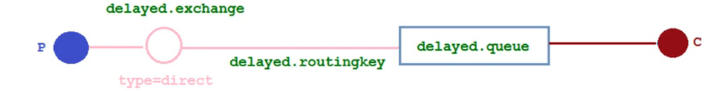

#### 2) 配置类

> 添加延迟交换机，延迟队里和对应路由键的配置

```java
// ======  添加三个常量配置
public static final String EXCHANGE_DELAYED = "delayed.exchange";
public static final String QUEUE_DELAYED = "delayed.queue";
public static final String ROUTING_KEY_DELAYED = "delayed.routingKey";

// ====== 配置队列、交换机、Binding
@Bean
public CustomExchange delayExchange(){
    /* 自定义配置交换机
        *   - 第一个为交换机名称
        *   - 第二个为交换机类型，这里是 x-delayed-message 表示延迟交换机
        *   - 是否持久化
        *   - 是否自动删除
        *   - 其他配置 - 这里配置了该交换机与队列之间的匹配模式
        * */
    return new CustomExchange(
        RabbitConstant.EXCHANGE_DELAYED,
        "x-delayed-message",
        true, false,
        new HashMap<String, Object>(){{
            // 配置该交换机与队列的模式
            put("x-delayed-type", "direct");
        }}
    );
}

/**
* 配置延迟队列
* @return
*/
@Bean
public Queue delayQueue(){
    return QueueBuilder.durable(RabbitConstant.QUEUE_DELAYED).build();
}

/**
* 绑定延迟队列和延迟交换机
* @return
*/
@Bean
public Binding delayQueueToExchange(){
    return BindingBuilder.bind(delayQueue()).to(delayExchange()).with(RabbitConstant.ROUTING_KEY_DELAYED).noargs();
}
```

#### 3) 生产者

重新定义对外测试接口

```java
/**
* 基于插件实现延迟队列
* @param message 消息体
* @param ttl 自定义过期时间
*/
@GetMapping("/send/delay/{message}/{ttl}")
public void sendMesForDelayQueue(@PathVariable String message, @PathVariable Integer ttl){
    log.info("于 {} 向延迟队列 - {} 中发送一条 TTL 为 {} 毫秒的消息: {}", 
             new Date().toString(), RabbitConstant.QUEUE_DELAYED, ttl, message);
    rabbitTemplate.convertAndSend(
        RabbitConstant.EXCHANGE_DELAYED, RabbitConstant.ROUTING_KEY_DELAYED,
        message, msg -> {
            // 设置过期时长(毫秒)
            msg.getMessageProperties().setDelay(ttl);
            return msg;
        }
    );
}
```

#### 4) 消费者

```java
@RabbitListener(queues = RabbitConstant.QUEUE_DELAYED)
public void receiveDelayQueue(Message message, Channel channel){
    log.info("延迟队列 {} 于 {} 收到延迟消息为: {}", 
             RabbitConstant.QUEUE_DELAYED, new Date().toString(), new String(message.getBody())
            );
}
```

启动项目，访问 

http://localhost:8080/msg/send/delay/byqtxdy/20000

http://localhost:8080/msg/send/delay/tomoetyann/2000

查看控制台

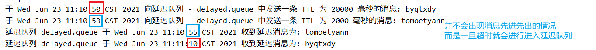

## 7.7 总结

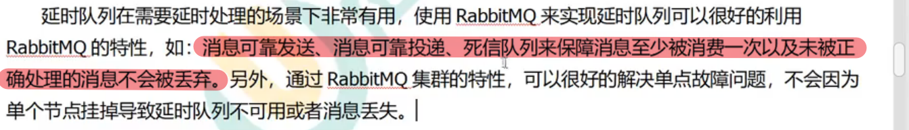

# 第八章 发布确认高级

> 防止生产者向 MQ Server 发送消息时，如果没有对应的交换机/队列，那么应该将未能发送成功的消息加入缓存再进行处理

## 8.1 优化交换机

1. 新建模块 `07-pub-confirm-adv`

2. 修改 POM，导入需要的依赖

   ```xml
   <!--RabbitMQ 依赖-->
   <dependency>
       <groupId>org.springframework.boot</groupId>
       <artifactId>spring-boot-starter-amqp</artifactId>
   </dependency>
   <dependency>
       <groupId>org.springframework.boot</groupId>
       <artifactId>spring-boot-starter-web</artifactId>
   </dependency>
   <dependency>
       <groupId>org.springframework.boot</groupId>
       <artifactId>spring-boot-starter-test</artifactId>
       <scope>test</scope>
   </dependency>
   <dependency>
       <groupId>com.alibaba</groupId>
       <artifactId>fastjson</artifactId>
       <version>1.2.47</version>
   </dependency>
   <dependency>
       <groupId>org.projectlombok</groupId>
       <artifactId>lombok</artifactId>
   </dependency>
   <!-- 添加 Swagger 依赖 -->
   <dependency>
       <groupId>io.springfox</groupId>
       <artifactId>springfox-boot-starter</artifactId>
       <version>3.0.0</version>
   </dependency>
   <!--RabbitMQ 测试依赖-->
   <dependency>
       <groupId>org.springframework.amqp</groupId>
       <artifactId>spring-rabbit-test</artifactId>
       <scope>test</scope>
   </dependency>
   ```

3. 创建 `application.properties` 添加 Rabbit 相关的配置

   ```properties
   # 配置 Rabbit MQ 的连接
   spring.rabbitmq.addresses=192.168.127.139
   spring.rabbitmq.port=5672
   spring.rabbitmq.username=prover
   spring.rabbitmq.password=123456
   # 开启生产者发布确认(默认是 none 不开启发布确认，correlated 表示发布消息成功到交换器后会触发回调方法， SIMPLE 类似于单步发布确认回调)
   spring.rabbitmq.publisher-confirm-type=correlated
   ```

4. 创建常量类和配置类

   ```java
   public class RabbitmqConstant {
   
       public final static String EXCHANGE_DIRECT_CONFIRM = "confirm.exchange";
   
       public final static String QUEUE_CONFIRM = "confirm.queue";
   
       public final static String ROUTING_KEY_CONFIRM = "confirm";
   }
   ```

   ```java
   @Configuration
   public class RabbitmqComponentConfig {
   
       @Bean
       public DirectExchange confirmExchange(){
           return new DirectExchange(RabbitmqConstant.EXCHANGE_DIRECT_CONFIRM);
       }
   
       @Bean
       public Queue confirmQueue(){
           return QueueBuilder.durable(RabbitmqConstant.QUEUE_CONFIRM).build();
       }
   
       @Bean
       public Binding confirmBinding(){
           return BindingBuilder.bind(confirmQueue()).to(confirmExchange()).with(RabbitmqConstant.ROUTING_KEY_CONFIRM);
       }
   }
   ```

5. **创建回调函数**，当消息发送/未能发送到交换机时，应该进行相关处理

   ```java
   @Component
   @Slf4j
   public class ConfirmCallback implements RabbitTemplate.ConfirmCallback {
   
   
       @Autowired
       private RabbitTemplate rabbitTemplate;
   
       @PostConstruct
       public void initRabbitTemplate(){
           // 设置 rabbitTemplate 中发布确认用的回调
           rabbitTemplate.setConfirmCallback(this);
       }
   
       /**
        * 回调函数, 无论消息是否到达 exchange 都会触发的回调函数
        * @param correlationData 保存回调消息的相关信息
        * @param ack 是否到达 exchange
        * @param cause 出错的原因
        */
       @Override
       public void confirm(CorrelationData correlationData, boolean ack, String cause) {
           String id = correlationData != null ? correlationData.getId() : "";
           if (ack){
               log.info("id 为 {} 的消息成功被交换机接收" , id);
           } else {
               log.error("id 为 {} 的消息没能成功被交换机接收，原因为:{}", id, cause);
           }
       }
   
   }
   ```

6. 创建消费者

   ```java
   @Component
   @Slf4j
   public class MessageConsumer {
   
       @RabbitListener(queues = RabbitmqConstant.QUEUE_CONFIRM)
       public void receiveConfirmQueue(Message message){
           log.info("{} 队列收到消息:{}", RabbitmqConstant.QUEUE_CONFIRM, new String(message.getBody()));
       }
   
   }
   ```

7. 创建生产者

   ```java
   @Slf4j
   @Controller
   @RequestMapping("/msg")
   public class MessageController {
   
       @Autowired
       private RabbitTemplate rabbitTemplate;
   
   
       @GetMapping("/send/{message}")
       public void sendConfirmMsg(@PathVariable String message){
           // 创建一个 CorrelationData 对象，里面可以配置一些消息的信息用于回调函数时使用
           CorrelationData correlationData = new CorrelationData("1");
           rabbitTemplate.convertAndSend(
               RabbitmqConstant.EXCHANGE_DIRECT_CONFIRM,
               RabbitmqConstant.ROUTING_KEY_CONFIRM,
               message, correlationData
           );
           log.info("向 {} 队列发送消息:{}", RabbitmqConstant.QUEUE_CONFIRM, message);
       }
   
   }
   ```

8. 启动，访问 http://localhost:8080/msg/send/byqtxdy

   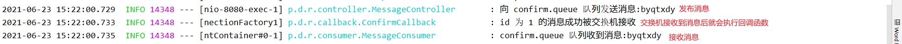

9. 修改生产者代码，将交换机名称写错再进行测试

   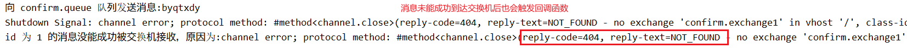

   修改生产者代码，保证交换机正确，但路由键错误

   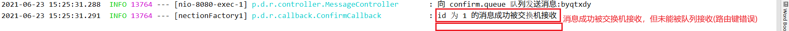

## 8.2 回退消息

> 针对消息达到交换机，却没能到达队列的情况

### Mandatory 参数

如果仅仅**开启了生产者发布确认机制**的情况下，交换机接收消息后会直接发送消息给生产者回调函数(接受不到也会)，但此时如果指定的路由的队列并不存在或存在其他问题，那么消息就会被==直接丢弃==，而生产者并不知道

而通过设置 `mandatory` 参数可以在消息过程中将不可达到目的的消息回退给生产者

### 编码

1. 在配置文件中添加配置项

   ```properties
   # 开启回退消息
   spring.rabbitmq.publisher-returns=true
   ```

2. 使 **ConfirmCallback** 类额外实现 ==RabbitTemplate.ReturnsCallback== 接口，重写 `returnedMessage(ReturnedMessage returnedMessage)` 方法

   ```java
   /**
   * 当消息无法到达队列使，回调消息会调用的函数
   * @param returnedMessage
   */
   @Override
   public void returnedMessage(ReturnedMessage returnedMessage) {
       log.error("无法找到交换机 {} 中路由 key 为 {} 的队列，消息为: {}, 错误原因为: {}"
                 , returnedMessage.getExchange(), returnedMessage.getRoutingKey()
                 , new String(returnedMessage.getMessage().getBody()), returnedMessage.getReplyText()        
                );
   }
   ```

3. 设置 `rabbitTemplate` 的回退消息处理类

   ```java
   rabbitTemplate.setReturnsCallback(this);
   ```

4.  重启，测试

   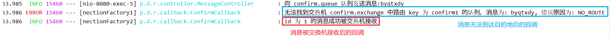

## 8.3 备份交换机

### 简介

可以使用 **死信队列** 存储处理失败的消息，而对于 **无法到达路由** 的消息可以则可以使用 **备份交换机**

在声明一个交换机时同时声明它的备份交换机，当该交换机接收到一条 **不可路由** 的消息时，就将消息交给备份交换机处理，由备份交换机来处理消息

如果同时使用了 **回退消息** 和 **备份交换机** 则优先使用 ==备份交换机==

### 代码结构图

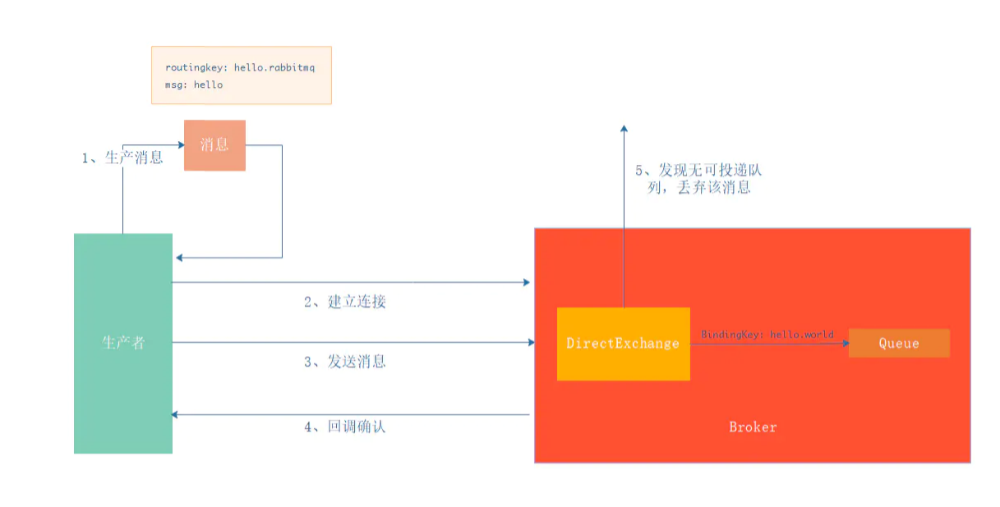

### 实战

1. 添加常量 + 组件配置

   ```java
   public final static String EXCHANGE_FANOUT_BACKUP_CONFIRM = "backup.confirm.exchange";
   public final static String QUEUE_BACKUP_CONFIRM = "backup.confirm.queue";
   ```

   ```java
   @Configuration
   public class RabbitmqComponentConfig {
   
       @Bean
       public DirectExchange confirmExchange(){
   //        return new DirectExchange(RabbitmqConstant.EXCHANGE_DIRECT_CONFIRM);
           return ExchangeBuilder.directExchange(RabbitmqConstant.EXCHANGE_DIRECT_CONFIRM)
                   // alternate(String exchange) 配置备份交换机
                   .alternate(RabbitmqConstant.EXCHANGE_FANOUT_BACKUP_CONFIRM).build();
       }
   
       /**
        * 配置备份交换机
        * @return
        */
       @Bean
       public FanoutExchange backupConfirmExchange(){
           return new FanoutExchange(RabbitmqConstant.EXCHANGE_FANOUT_BACKUP_CONFIRM);
       }
   
      
   
       /**
        * 配置备份队列
        * @return
        */
       @Bean
       public Queue backupConfirmQueue(){
           return QueueBuilder.durable(RabbitmqConstant.QUEUE_BACKUP_CONFIRM).build();
       }
   
       /**
        * 配置报警队列
        * @return
        */
       @Bean
       public Queue warningConfirmQueue(){
           return QueueBuilder.durable(RabbitmqConstant.QUEUE_WARNING_CONFIRM).build();
       }
   
       /**
        * 绑定备份队列和交换机
        * @return
        */
       @Bean
       public Binding backupQueueToExchangeBinding(){
           return BindingBuilder.bind(backupConfirmQueue()).to(backupConfirmExchange());
       }
   
       /**
        * 绑定报警队列和交换机
        * @return
        */
       @Bean
       public Binding warningQueueToExchangeBinding(){
           return BindingBuilder.bind(warningConfirmQueue()).to(backupConfirmExchange());
       }
       
       ....
   }
   ```

2. 编写报警队列的消费者

   ```java
   @RabbitListener(queues = RabbitmqConstant.QUEUE_WARNING_CONFIRM)
   public void receiveWarningConfirmQueue(Message message){
       log.error("{} 报警队列收到消息:{}", RabbitmqConstant.QUEUE_WARNING_CONFIRM, new String(message.getBody()));
   }
   ```

3. 通过 RabbitMQ Server 的后台管理，删除原交换机(因为重新配置了)

4. 启动测试

   

# 第九章 其他知识点

## 9.1 幂等性

### 概念

**用户对应同一操作的一次/多次请求的结果是一致的，不会因为多次点击而产生副作用**，例如：

1. 博客系统同一个用户对同一个文章点赞，即使这人单身30年手速疯狂按点赞，那么实际上也只能给这个文章 +1 赞
2. 在微信支付的时候，一笔订单应当只能扣一次钱，那么无论是网络问题或者bug等而重新付款，都只应该扣一次钱

### 消息重复消费

消费者在消费mq中的消息时，mq已把消息发送给消费者，消费者在给mq返回ack时网络中断，故mq未收到确认信息，该条消息**会重新**发给其他的消费者，或者在网络重连后再次发送给该消费者，但实际上该消费者已成功消费了该条消息，造成消费者消费了重复的消息；

**解决思路: ** (唯一 ID + 指纹码) / Redis 原子性

### 唯一 ID + 指纹码

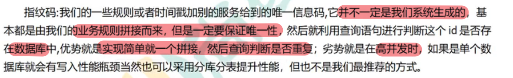

### Redis 原子性

利用 Redis 执行 `setnx` 命令，天然具有幂等性，从而实现不重复消息

## 9.2 优先级队列

### 使用场景

**订单催付:** 对应大客户的消息，应该具有更高的优先级，优先让消费者收到

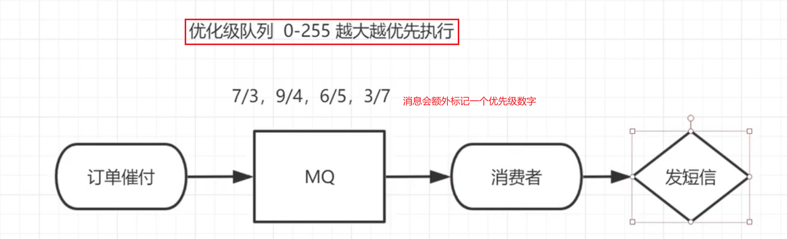

### 实战

1. 配置优先级队列

   ```java
   @Configuration
   public class RabbitComponentConfig {
   
       public final static String QUEUE_Priority = "pir.queue";
   
       @Bean
       public Queue priQueue(){
           /*
           * maxPriority(int num): 指定该队列的最大优先级
           *   - 允许的最大值是 255，这里指定为 10
           * */
           return QueueBuilder.durable(QUEUE_Priority).maxPriority(10).build();
       }
   
   }
   ```

2. 配置消费者

   ```java
   @Component
   @Slf4j
   public class MessageConsumer {
       
       @RabbitListener(queues = RabbitComponentConfig.QUEUE_Priority)
       public void receivePriQueue(Message message){
           log.info("优先级队列收到消息:{}, 优先级为: {}",
                   new String(message.getBody()),
                   message.getMessageProperties().getPriority()
           );
       }
       
   }
   ```

3. 配置生产者

   ```java
   @Controller
   @Slf4j
   @RequestMapping("/msg")
   public class MessageController {
   
       @Autowired
       private RabbitTemplate rabbitTemplate;
   
       @GetMapping("/send/{message}/{priority}")
       public void sendMsg(@PathVariable String message, @PathVariable Integer priority){
           rabbitTemplate.convertAndSend("", RabbitComponentConfig.QUEUE_Priority,
                   message, msg -> {
                       // 设置消息的优先级
                       msg.getMessageProperties().setPriority(priority);
                       return msg;
                   }
           );
           log.info("成功发送消息");
       }
   
   }
   ```

4. 启动前，先将消费者的 `@Component` 注解注释，保证队列中有两个以上的消息可以排序

   访问 `http://localhost:8080/msg/send/消息体/优先级`  注意优先级设置

5. 取消注释，重启服务器，查看命令行

   

   优先级更高的消息会先被消费

## 9.3 惰性队列

### 概念

惰性队列会尽可能将消息(无论是持久化还是非持久化)存入磁盘中，当消费者需要消费相应消息时才会被加载到内存中

优点在于 **支持更长的队列，可以存储更多消息。** 缺点在于 **速度慢**，且如果存入的是**非持久化**的消息，重启后依然会消息

**适用场景: ** 当消费者因为某些原因宕机，不能正常使用时，就可以

默认情况下，RabbitMQ 接收消息后，队列中的消息会尽可能存储在 **内存** 中，就可以更快的将消息发送给消费者，即使是持久化的消息，在被写入磁盘的同时也会在内存中驻留一份

RabbitMQ 需要释放内存时，会将内存中的消息换页至磁盘中，这个操作会耗费较长时间，也会阻塞队列的操作，==进而无法接受新的消息==

### **配置**

1. 通过 Java API 的方式

   ```java
   Map<String, Object> args = new HashMap<String, Object>();
   args.put("x-queue-mode", "lazy");
   channel.queueDeclare("myqueue", false, false, false, args);
   ```

2. 通过命令行(Policy)的方式

   ```java
   rabbitmqctl set_policy Lazy "^myqueue$" '{"queue-mode":"lazy"}' --apply-to queues
   ```

> 如果一个队列同时使用这两种方式设置的话，那么 Policy 的方式具备更高的优先级。
>
> 如果要通过声明的方式改变已有队列的模式的话，那么只能先删除队列，然后再重新声明一个新的

# 第十章 集群

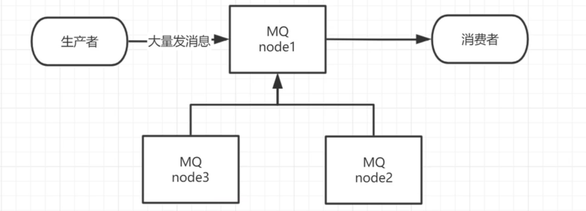

## 10.1 搭建集群

1. 额外创建两台虚拟机，并部署 RabbitMQ

2. 修改主机名(node1, node2, node3) 并重启

   ```shell
   vim /etc/hostname
   ```

3. 配置各个节点，让各个节点能够互相识别对方

   ```shell
   vim /etc/hosts
   ```

   ```shell
   192.168.127.139 node1
   192.168.127.140 node2
   192.168.127.141 node3
   ```

4. 在 node1 上执行远程操作命令保证三台节点的 cookie 文件一样

   ```shell
   scp /var/lib/rabbitmq/.erlang.cookie root@node2:/var/lib/rabbitmq/.erlang.cookie
   scp /var/lib/rabbitmq/.erlang.cookie root@node3:/var/lib/rabbitmq/.erlang.cookie
   ```

5. 启动三台虚拟机的 RabbitMQ 和 Erlang 

   ```shell
   rabbitmq-server -detached
   ```

6. 在 节点2 和 节点3 执行以下命令，将 RabbitMQ Server 服务加入到集群中

   确保加入节点的虚拟机防火墙要关闭

   ```shell
   rabbitmqctl stop_app # rabbitmqctl stop 会将 Erlang 虚拟机关闭，rabbitmqctl stop_app 只关闭 RabbitMQ 服务)
   rabbitmqctl reset
   rabbitmqctl join_cluster rabbit@node1 # 要加入到哪个节点构建的集群中
   rabbitmqctl start_app # 只启动应用服务
   ```

7. 查看集群状态

   ```shell
   rabbitmqctl cluster_status
   ```

   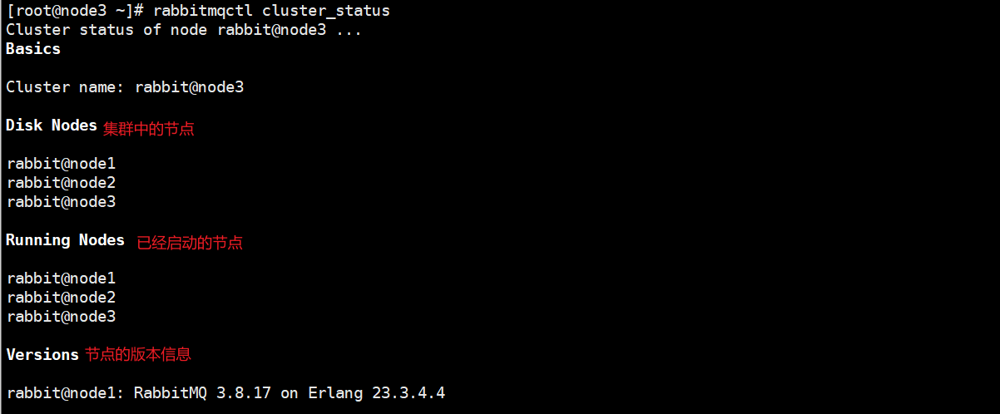

8. 新建用户

   ```shell
   rabbitmqctl add_user admin 123
   rabbitmqctl set_user_tags admin administrator
   rabbitmqctl set_permissions -p "/" admin ".*" ".*" ".*"
   ```

   访问任意节点的 RabbitMQ 后台

   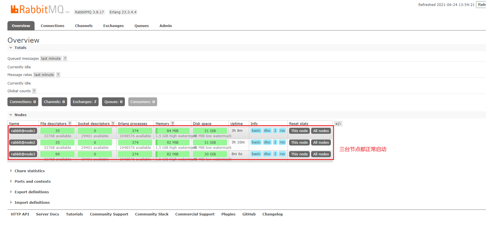

9. [可选] 从集群中脱离

   ```shell
   #node2 机器上执行
   rabbitmqctl stop_app
   rabbitmqctl reset
   rabbitmqctl start_app
   rabbitmqctl cluster_status
   
   #node1 机器上执行
   rabbitmqctl forget_cluster_node rabbit@node2 
   ```

## 10.2 镜像队列

### 概念

集群中一个 Broker 节点宕机之后，该节点中的队列和消息都将 **无法使用**，即使恢复了，但如果没有设置持久化，也会导致消息丢失

而引入镜像队列的机制，可以将该**队列镜像(备份)在集群中的其他 Broker** 之上，如果集群中的一个节点失效了，队列能**自动的切换**到备份的另一个节点上以==保证服务的可用性==

### 搭建步骤

1. 在 RabbitMQ Server 后台管理中配置 **策略**

   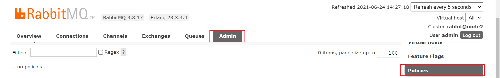

   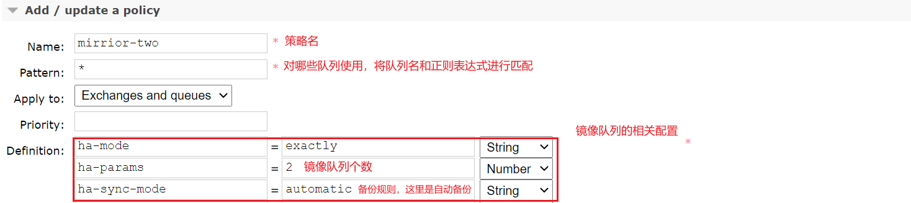

2. 添加一个新队列

   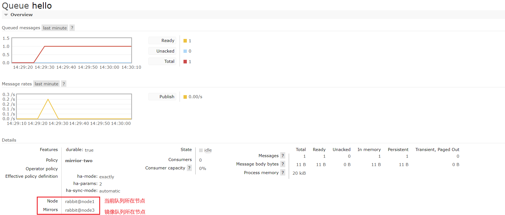

3. 关闭 node1 上的 RabbitMQ 服务

4. 查看队列状态，启动消费者访问 RabbitMQ 获取消息

   

   > 注意：此时使用消费者访问时不能访问原 node1 节点，而是要访问 node3 节点

**总结:** 就算整个集群只剩下一台机器了 依然能消费队列里面的消息，说明队列里面的消息被镜像队列传递到相应机器里面了

## 10.3 Nginx 负载均衡

> 注意 Nginx 需要额外编译 Steam 模块

1. 修改 Nginx 配置文件

   ```javascript
   stream {
       upstream rabbitmqcluster{
           server 192.168.127.139:5672;
           server 192.168.127.140:5672;
           server 192.168.127.141:5672;
       }
       server {
           listen 8081;
           proxy_pass rabbitmqcluster;
       }
   }
   ```

2. 修改项目中的连接属性，ip 和 port 为反向代理主机的j即可

   ```properties
   spring.rabbitmq.addresses=192.168.127.139
   spring.rabbitmq.port=8081
   spring.rabbitmq.username=admin
   spring.rabbitmq.password=123
   ```

   


