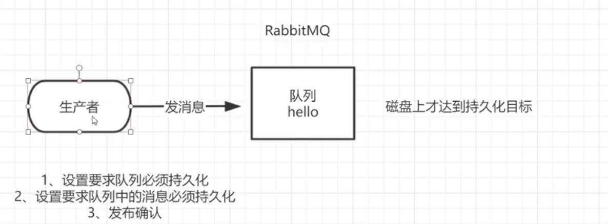

# RabbitMQ 消息中间件的学习

# 第一章 消息队列

## 1.1 MQ 的相关概念

### 简介

> 什么是 MQ

Message queue，从字面上来看，本质上就是个队列，遵循**先入先出**，队列中存放的内容就是 message，是一种**跨进程的通信机制**，用于上下游传递消息。在互联网架构中，MQ 是一种非常常见的 **逻辑解耦 + 物理结构** 的消息通信服务，使用了 MQ 之后，消息发送上游只需要依赖 MQ,不用依赖其他服务

> 为什么使用

1. 流量消峰

   假设一个订单系统最多处理一万次订单，但在高峰期时，可能订单数会远远大于一万，这个时候就可以利用消息队列进行缓冲，将一秒内下的订单分散一段时间来处理，虽然会使某些用户在下单十几秒后才能收到下单成功的操作

   

2. 应用解耦

   假设一个电商应用，应用中存在订单、库存、物流、支付等模块，如果耦合调用多个模块，其中任何一个子模块出现问题，就会导致下单操作异常

   这是就可以利用消息队列，例如此时出现问题的是物流系统，需要几分钟来修复，而这几分钟内，物流系统要处理的数据会被缓存在队列中，用户下单操作依然可以正常完成，提高熊的可用性

3. 异步处理

   某些服务间的调用是异步的，例如 A 调用 B，B 需要很长时间执行，但是 A 需要知道 B 什么时候执行完成

   这时就可以利用消息队列，当 A 调用 B 服务后. 只需要监听 B 处理后的信息，当 B 处理之后发送消息给 MQ ，MQ 会将此消息发送给 A 服务，A 再进行处理即可

   

### 分类

1. ActiveMQ
   - 优点：单机吞吐量万级，时效性 ms 级，可用性高，基于**主从架构实现高可用性**，消息可靠性高，较低概率丢失数据
   - 缺点：维护少，高吞吐量场景较少
   
2. **Kafka**

   

3. RocketMQ

   

4. **RabbitMQ**

   

### 选择

1. Kafka - 数据量大，需求吞吐量高或者需要做 **日志采集** 功能，建议使用 Kafka
2. RocketMQ - 为金融互联网行业使用，对于要求可靠性较高的场景业务(订单，业务消峰等)，建议使用 RocketMQ
3. RabbitMQ - 结合 erlang 的场景下使用，性能好时效性高，社区活跃度也高，如果数据量不大，建议使用比较完备的 RabbitMQ

## 1.2 RabbitMQ 

> 主要做消息数据的接收，存储和转发

### 四大基本概念


1. 生产者：生产数据并发送
2. 交换机：负责接收生产者的消息，另一方面将其推送到队列中，**消息的处理，都是由交换机决定的**
3. 队列：数据结构，负责存储消息，本质上就是一个大的消息缓存区，消费者中者其中获取消息
4. 消费者：接收数据并消费

### 六大模式

简单模式、工作模式、发布订阅模式、路由模式、主题模式、发布确认模式

### 名词解释

**RabbitMQ 工作原理：**


- Broker：一个 RabbitMQ Server

- Virtual host：出于多住户和安全因素设计，把 AMQP 的基本组件划分到一个虚拟的分组中。当多个不同的用户使用同一个 Broker 提供的服务时，可以在 Broker 内部划分出多个 vhost，**每个用户在自己的 vhost 创建 exchange/queue** 等

- Connection：publish /  consumer **和 broker 之间的 TCP 连接**

- Channel：

  由于建立的 Connection 的开销太大，所以使用内部的 Channel 作为**逻辑连接**。如果应用程序支持多线程，通常每个 thread 创建单独的 channel 进行通讯即可。

  AMQP method 包含了 channel id 帮助**客户端和 Broker 识别 channel** ，所以 channel 之间是完全隔离的，

  **channel 作为轻量级的 Connection 极大减少了操作熊建立 TCP 连接的开销**

- Exchange：消息达到 Broker 的第一站，根据不同的分发规则，查询表中的 routing key，将消息分发到不同的队列中去

  常用的规则有：direct、topic、fanout

- Queue：消息存储的地方，等待被取走

- Binding：**exchange 和 queue 之间**建立的虚拟连接，binding 中可以包含 routing key，Binding 的信息会被保存到 Exchange 中的查询表去，用于消息分发的依据

### 安装

1. RabbitMQ Github 下载地址：https://github.com/rabbitmq/rabbitmq-server/releases

   Elrang Github 下载地址：https://github.com/rabbitmq/erlang-rpm/releases

2. 下载对应的解压包到 Linux 中

3. 按照 Erlang 和需要的依赖

   ```shell
   rpm -ivh erlang-23.3.4.4-1.el7.x86_64.rpm
   yum install socat -y
   ```

4. 安装 RabbitMQ 

   ```shell
   rpm -ivh rabbitmq-server-3.8.17-1.el7.noarch.rpm
   ```

5. 启动并查看 RabbitMQ 服务

   ```shell
   systemctl start rabbitmq-server.service
   systemctl status rabbitmq-server.service
   ```

6. 设置成开机启动

   ```shell
   chkconfig rabbitmq-server on
   ```

7. 安装图形化插件

   ```shell
   rabbitmq-plugins enable rabbitmq_management
   ```

8. 重启 rabbitmq

   ```shel
   systemctl restart rabbitmq-server.service
   ```

9. 关闭防火墙后访问对应的 15672 端口

   

   账户密码默认是 guest，但由于不是 localhost，所以需要创建新用户授权后才可以访问

   

10. 创建新用户

    ```shell
    rabbitmqctl add_user {用户名} {密码} # 创建新用户
    rabbitmqctl set_user_tags {用户名} administrator # 添加角色
    rabbitmqctl set_permissions -p ”/“ {用户名} ”.*“ ".*" ".*" # 设置权限
    rabbitmqctl list_users # 查看所有用户和角色
    ```

    

11. 重新使用新账号登录

    

# 第二章 Hello World


1. 创建新模块 `01-hello-world`

2. 导入需要的依赖

   ```xml
   <dependencies>
       <dependency>
           <groupId>com.rabbitmq</groupId>
           <artifactId>amqp-client</artifactId>
           <version>5.12.0</version>
       </dependency>
       <dependency>
           <groupId>commons-io</groupId>
           <artifactId>commons-io</artifactId>
           <version>2.10.0</version>
       </dependency>
   </dependencies>
   
   <build>
       <plugins>
           <plugin>
               <groupId>org.apache.maven.plugins</groupId>
               <artifactId>maven-compiler-plugin</artifactId>
               <configuration>
                   <source>8</source>
                   <target>8</target>
               </configuration>
           </plugin>
       </plugins>
   </build>
   ```

3. 编写生产者代码

   ```java
   public class MessageProducer {
   
       // 定义队列名
       private static final String QUEUE_NAME = "hello";
       // 定义主机地址
       private static final String HOST = "192.168.127.139";
       // 定义连接 RabbitMQ Server 用户名
       private static final String USER_NAME = "prover";
       // 定义连接 RabbitMQ Server 密码
       private static final String PASSWORD = "123456";
   
       public static void main(String[] args) throws IOException, TimeoutException {
           // 创建一个连接工厂
           ConnectionFactory factory = new ConnectionFactory();
           // 设置主键地址，用户名和免密
           factory.setHost(HOST);
           factory.setUsername(USER_NAME);
           factory.setPassword(PASSWORD);
           // 创建连接
           Connection connection = factory.newConnection();
           // 获取信道(Conn 内部的逻辑连接)
           Channel channel = connection.createChannel();
           /* 创建队列
           *   1. 队列名
           *   2. 队列中的消息是否实现持久化，默认存储在内存中
           *   3. 队列是否进行消费共享, true 表示多个消费者共享，false 表示只供一个消费者消费
           *   4. 是否自动删除，最后一个消费者服务器断开连接后，是否自动删除该队列
           *   5. 自动删除
           * */
           channel.queueDeclare(QUEUE_NAME, false, false, false, null);
           // 定义消费信息
           String message = "hello world";
           /* 利用信道发送消息
           *   1. 交换机名，默认使用空字符串即可
           *   2. 路由 key，这里使用队列名即可
           *   3. 其他参数
           *   4. 消息
           * */
           channel.basicPublish("", QUEUE_NAME, null, message.getBytes());
           System.out.println("消息发送完毕");
       }
   
   }
   ```

4. 运行后查看管理界面

   

5. 编写消费者代码

   ```java
   public class MessageConsumer {
   
       // 定义队列名
       private static final String QUEUE_NAME = "hello";
       // 定义主机地址
       private static final String HOST = "192.168.127.139";
       // 定义连接 RabbitMQ Server 用户名
       private static final String USER_NAME = "prover";
       // 定义连接 RabbitMQ Server 密码
       private static final String PASSWORD = "123456";
   
       public static void main(String[] args) throws IOException, TimeoutException {
           // 创建一个连接工厂
           ConnectionFactory factory = new ConnectionFactory();
           // 设置主键地址，用户名和免密
           factory.setHost(HOST);
           factory.setUsername(USER_NAME);
           factory.setPassword(PASSWORD);
           // 创建连接
           Connection connection = factory.newConnection();
           // 获取通信(Conn 内部的逻辑连接)
           Channel channel = connection.createChannel();
           /* 通过通信获取消息
           *   1. 消息队列
           *   2. 消费成功后是否自动答应
           *   3. 消息送达时通知的回调接口
           *   4. 消费者取消消费的回调接口
           * */
           channel.basicConsume(QUEUE_NAME, true,
                   (consumerTag, message) -> System.out.println(consumerTag + ":" + new String(message.getBody())),
                   (consumerTag) -> System.out.println("消息消费失败:" + consumerTag)
           );
       }
   
   }
   ```

6. 运行，查看控制台打印的消息

   


# 第三章 Work Queue

> 当中间件中突然涌进大量任务(消息)时，为了能够快速的解决任务，就需要多个工作线程(消费者)使用根据一定的分发算法进行对应的任务
>
> 

## 3.1 轮询分发消息

1. 创建工具类，将与 RabbitMQ 连接部分的代码抽取出来

   ```java
   public class RabbitmqUtil {
   
       // 定义队列名
       private static final String QUEUE_NAME = "hello";
       // 定义主机地址
       private static final String HOST = "192.168.127.139";
       // 定义连接 RabbitMQ Server 用户名
       private static final String USER_NAME = "prover";
       // 定义连接 RabbitMQ Server 密码
       private static final String PASSWORD = "123456";
   
       /**
        * 返回与 Rabbitmq Server 连接的 Channel 
        * @return
        * @throws IOException
        * @throws TimeoutException
        */
       public static Channel getChannel() throws IOException, TimeoutException {
           // 创建一个连接工厂
           ConnectionFactory factory = new ConnectionFactory();
           // 设置主键地址，用户名和免密
           factory.setHost(HOST);
           factory.setUsername(USER_NAME);
           factory.setPassword(PASSWORD);
           // 创建连接
           Connection connection = factory.newConnection();
           // 获取通信(Conn 内部的逻辑连接)
           return connection.createChannel();
       }
   
   }
   ```

2. 创建工作线程(消费者)

   ```java
   /**
    * @program: RabbitmqStudy
    * @description: 工作线程(消费者)
    * @author: EMTKnight
    * @create: 2021-06-21
    **/
   public class MessageWorker {
   
       // 定义队列名
       private static final String QUEUE_NAME = "hello";
   
       public static void main(String[] args) throws IOException, TimeoutException {
           Channel channel = RabbitmqUtil.getChannel();
           channel.basicConsume(QUEUE_NAME, true,
                   (consumerTag, message) -> System.out.println(consumerTag + ": 成功接收到消息 - " + new String(message.getBody())),
                   (consumerTag) -> System.out.println(consumerTag + ": 接收消息的过程中出现错误")
           );
       }
   
   }
   ```

   通过 IDEA 开启多个工作线程

   

3. 编写生产者代码

   ```java
   /**
    * @program: RabbitmqStudy
    * @description: 消息生产者
    * @author: EMTKnight
    * @create: 2021-06-21
    **/
   
   public class MessageConsumer {
   
       // 定义队列名
       private static final String QUEUE_NAME = "hello";
   
       public static void main(String[] args) throws IOException, TimeoutException {
           // 获取信道
           Channel channel = RabbitmqUtil.getChannel();
           // 配置队列
           channel.queueDeclare(QUEUE_NAME, false, false, false, null);
           // 从控制台中接收消息
           Scanner scanner = new Scanner(System.in);
           while (scanner.hasNext()){
               // 获取消息
               String message = scanner.next();
               // 发送消息
               channel.basicPublish("", QUEUE_NAME, null, message.getBytes());
               System.out.println("消息发送成功:" + message);
           }
       }
   
   }
   ```

4. 启动，通过在生产者工作台输入消息，两个工作线程实现 **轮询消费**

## 3.2 消息应答

### 概念

默认情况下，rabbitmq 向消费者传递消息后，就会立即将该消息标记为删除。而为了保证消息能够被正常消费，避免由于消费者的宕机，出现异常等导致消息丢失，rabbitmq 引入了消息应答机制

在消费者将消息消费完之后，**告诉 rabbitmq 他已经处理了，此时 rabbitmq 再将该消息删除**

### 自动应答


### 手动应答

#### 1) 批量应答

**支持批量应答(multiple)并且可以减少网络拥堵:** 开启批量应答的区别


#### 2) 消息自动重新入队


#### 3) 代码编写

1. 重新编写工作线程(消费者)代码

   ```java
   public class MessageAnswerWorker {
   
       // 定义队列名
       private static final String QUEUE_NAME = "hello";
   
       public static void main(String[] args) throws IOException, TimeoutException {
           Channel channel = RabbitmqUtil.getChannel();
           // 设置第二个参数取消自动应答
           channel.basicConsume(QUEUE_NAME, false,
                   (consumerTag, message) -> {
                       System.out.println(consumerTag + ": 成功接收到消息 - " + new String(message.getBody()));
                       // 模拟业务处理
                       try {
                           Thread.sleep(1000);
                       } catch (InterruptedException e) {
                           e.printStackTrace();
                       }
                       /*
                       * basicAck: 手动应答
                       *   - 第一个参数为消息表示
                       *   - 第二个参数为是否批量应答
                       * */
                       channel.basicAck(message.getEnvelope().getDeliveryTag(), false);
                   },
                   (consumerTag) -> System.out.println(consumerTag + ": 接收消息的过程中出现错误")
           );
       }
   }
   ```

   额外创建一个工作者线程，处理逻辑基本一致，只需要调整线程睡眠时间即可

   ```java
   Thread.sleep(10000);
   ```

2. 开启两个工作线程，如果第二个工作线程在处理(睡眠)的过程将其关闭，可以发现第一个工作线程会接收到处理失败的消息

   **避免了消息丢失**

   

## 3.3 持久化

### 概念

通过消息应答，可以避免由于消费者的问题导致消息丢失。但又如何避免由于 RabbitMQ Server 宕机而导致生产者生产的消息丢失呢? -> **将队列和消息进行持久化**

### 队列持久化

> RabbitMQ 不支持通过 API 修改原队列，所以要先删除对应的队列

1. 在 RabbitMQ 的后台管理中删除测试队列

   

2. 修改任一生产者代码中的队列配置

   ```java
   // 第二个参数表示开启队列的持久化
   channel.queueDeclare(QUEUE_NAME, true, false, false, null);
   ```

3. 重启 RabbitMQ Server 查看队列

   

### 消息持久化

1. 添加任一生产者代码在发送消息时的配置

   ```java
   // 第二个参数设置为 MessageProperties.PERSISTENT_TEXT_PLAIN 标识该消息需要持久化到磁盘上
   channel.basicPublish("", QUEUE_NAME, MessageProperties.PERSISTENT_TEXT_PLAIN, message.getBytes());
   ```

2. 重启 MQ Server 查看队列中的消息

   

   注意：这里的持久化方式，依然可能导致数据丢失(数据在准备写入时宕机)，但概率较低

### 不公平分发 - 能者多劳

1. 修改带有线程睡眠的工作线程代码，配置不公平分发

   ```java
   // 设置不公平分发，默认是 0 (轮询分发)
   channel.basicQos(1);
   ```

2. 启动测试，生产 4 条消息

   

   其原理是通过设置 qos ，表示消费者每次最多只接收 n 条消息进行处理，只有将消息处理结束，手动应答之后，下一条消息才会被分发进来。

### 预取值

一个消费者连接的 Channel 是存在一个 **未确认的消息缓冲区**，可以通过**设置预取值限制缓冲区的大小**，避免缓存区中**存在太多未确认的消息**，直到有消息被确认 MQ Server 才会再发送消息到该 Channel

通常增加预取值将提高消费者传递消息的速度，可以在消费者中设置 `qos` 设置预取值

# 第四章 发布确认 

> 队列持久化 + 消息持久化 + 发布确认 => 保证消息的安全性

## 4.1 概念

生产者可以将 Channel 设置成 confirm 模式，此时所有在该 Channel 上发布的消息都会被指派一个唯一的 ID(从 1 开始)，当消息被投递到所有匹配的队列之后，Broker 就会发送一个确认信息给生产者(包含消息的唯一 ID)

如果消息和队列都是**可持久化**的，那么确认消息就会在消息写入磁盘后发出，回传的确认消息中的 delivery-tag 域包含了确认消息的序列号

confirm 是异步的，发布消息后，生产者可以在等待返回确认的同时继续发送下一条消息，当消息确认后，便通过回调方法来处理该确认信息。如果 Broker 因为自身原因导致消息丢失，就会发送一条 nack 消息，生产者可以在回调方法中处理该消息



## 4.1 确认

### 单个确认发布

一种简单的确认方式，同时也是一种**同步确认发布**(生产者必须等待它被确认发布才可以)的方式

缺点：**发布速度特别慢**

```java
/**
 * @program: RabbitmqStudy
 * @description: 测试单个发布确认 - 672
 * @author: EMTKnight
 * @create: 2021-06-21
 **/

public class SingleProducer {

    public static void main(String[] args) throws IOException, TimeoutException, InterruptedException {
        // 随机创建一个队列名
        String queueName = UUID.randomUUID().toString();
        // 获取通信
        Channel channel = RabbitmqUtil.getChannel();
        // 配置队列
        channel.queueDeclare(queueName, false, false, false , null);
        // 开启发布确认
        channel.confirmSelect();
        // 获取开始时间
        long start = System.currentTimeMillis();
        for (int i = 0; i < 1000; i++) {
            // 发布消息
            channel.basicPublish("", queueName, null, ("消息" + i).getBytes());
            // 等待发布确认
            boolean flag = channel.waitForConfirms();
            if (flag) {
                System.out.println("消息" + i + ": 成功发送");
            }
        }
        // 获取结束时间
        long end = System.currentTimeMillis();
        System.out.println("使用单个确认发布发送 1000 个消息，耗时:" + (end - start));
    }

}
```

### 批量确认发布

可以先发布一批消息后再一起确认，这样可以提高系统的吞吐量

缺点：

1. 如果出现异常，很难找出其中是哪一个出现异常，需要将整个批处理保存在内存中，以记录重要的信息而后重新发布消息
2. 这种方案也是同步的

```java
/**
 * @program: RabbitmqStudy
 * @description: 批量确认发布 - 109
 * @author: EMTKnight
 * @create: 2021-06-21
 **/

public class BatchProducer {

    public static void main(String[] args) throws IOException, TimeoutException, InterruptedException {
        // 随机创建一个队列名
        String queueName = UUID.randomUUID().toString();
        // 获取通信
        Channel channel = RabbitmqUtil.getChannel();
        // 配置队列
        channel.queueDeclare(queueName, false, false, false , null);
        // 开启发布确认
        channel.confirmSelect();
        // 获取开始时间
        long start = System.currentTimeMillis();

        for (int i = 1; i <= 1000; i++) {
            // 发布消息
            channel.basicPublish("", queueName, null, ("消息" + i).getBytes());
            // 发布确认
            if (i % 100 == 0) {
                boolean flag = channel.waitForConfirms();
                if (flag) {
                    System.out.println("批量发布确认成功");
                } else {
                    System.out.println("批量发布确认失败");
                }
            }
        }

        // 获取结束时间
        long end = System.currentTimeMillis();
        System.out.println("使用批量确认发布发送 1000 个消息，耗时:" + (end - start));
    }

}
```

### 异步确认发布

利用**回调函数**来达到消息可靠性传递，可靠性和效率都比前两种高  

缺点：编程逻辑复杂


```java
/**
 * @program: RabbitmqStudy
 * @description: 异步发布确认 - 43
 * @author: EMTKnight
 * @create: 2021-06-21
 **/

public class AsyncProducer {

    public static void main(String[] args) throws IOException, TimeoutException {
        // 随机创建一个队列名
        String queueName = UUID.randomUUID().toString();
        // 获取通信
        Channel channel = RabbitmqUtil.getChannel();
        // 配置队列
        channel.queueDeclare(queueName, false, false, false , null);
        // 开启发布确认
        channel.confirmSelect();
        // 获取开始时间
        long start = System.currentTimeMillis();

        /*
        * 添加异步确认发布回调函数
        *   第一个参数为成功发布的回调函数
        *   第二个参数为发布失败的回调函数
        *   * 两个参数为同一个函数式接口的实现类
        *       - 第一个参数是消息的序列号(标识)
        *       - 第二个参数是消息是否为批量确认
        * */
        channel.addConfirmListener(
            (deliveryTag, nackCallback) -> System.out.println(deliveryTag + "消息发布确认成功"),
            (deliveryTag, nackCallback) -> System.out.println(deliveryTag + "消息发布确认失败")
        );

        for (int i = 1; i <= 1000; i++) {
            // 发布消息
            channel.basicPublish("", queueName, null, ("消息" + i).getBytes());
        }

        // 获取结束时间
        long end = System.currentTimeMillis();
        System.out.println("使用异步确认发布发送 1000 个消息，耗时:" + (end - start));
    }

}
```

### 处理异步未发送消息

可以将为确认的消息放在一个**同步容器**中(ConcurrentSkipListMap)，key 值保存对应的消息表示，value 保存对应的消息体

这个集合负责在 confirm cllback 和发布线程中工作

```java
public static void main(String[] args) throws IOException, TimeoutException {
    // 创建同步容器
    ConcurrentSkipListMap<Long, String> dataMap = new ConcurrentSkipListMap<>();
    ...

    /*
    * 添加异步确认发布回调函数
    *   第一个参数为成功发布的回调函数
    *   第二个参数为发布失败的回调函数
    *   * 两个参数为同一个函数式接口的实现类
    *       - 第一个参数是消息的序列号(标识)
    *       - 第二个参数是消息是否为批量确认
        * */
    channel.addConfirmListener(
        (deliveryTag, multiple) -> {
            // 判断是否为批量确认
            if (multiple) {
                dataMap.headMap(deliveryTag).clear();
            } else {
                // 从容器中删除对应的消息
                dataMap.headMap(deliveryTag);
            }
            System.out.println(deliveryTag + "消息发布确认成功");
        },
        (deliveryTag, multiple) -> {
            String message = dataMap.get(deliveryTag);
            System.out.println(deliveryTag + "消息发布确认失败, 具体的消息体为:" + message);
        }
    );

    for (int i = 1; i <= 1000; i++) {
        // 发布消息
        channel.basicPublish("", queueName, null, ("消息" + i).getBytes());
        // 将消息和对应的序列号保存到容器中
        dataMap.put(channel.getNextPublishSeqNo(), ("消息" + i));
    }

    ...
}
```


