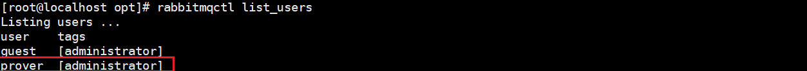
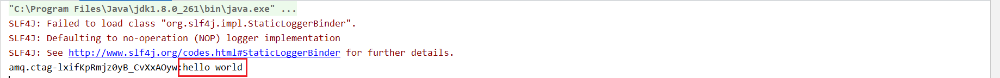

# RabbitMQ 消息中间件的学习

# 第一章 消息队列

## 1.1 MQ 的相关概念

### 简介

> 什么是 MQ

Message queue，从字面上来看，本质上就是个队列，遵循**先入先出**，队列中存放的内容就是 message，是一种**跨进程的通信机制**，用于上下游传递消息。在互联网架构中，MQ 是一种非常常见的 **逻辑解耦 + 物理结构** 的消息通信服务，使用了 MQ 之后，消息发送上游只需要依赖 MQ,不用依赖其他服务

> 为什么使用

1. 流量消峰

   假设一个订单系统最多处理一万次订单，但在高峰期时，可能订单数会远远大于一万，这个时候就可以利用消息队列进行缓冲，将一秒内下的订单分散一段时间来处理，虽然会使某些用户在下单十几秒后才能收到下单成功的操作

   

2. 应用解耦

   假设一个电商应用，应用中存在订单、库存、物流、支付等模块，如果耦合调用多个模块，其中任何一个子模块出现问题，就会导致下单操作异常

   这是就可以利用消息队列，例如此时出现问题的是物流系统，需要几分钟来修复，而这几分钟内，物流系统要处理的数据会被缓存在队列中，用户下单操作依然可以正常完成，提高熊的可用性

3. 异步处理

   某些服务间的调用是异步的，例如 A 调用 B，B 需要很长时间执行，但是 A 需要知道 B 什么时候执行完成

   这时就可以利用消息队列，当 A 调用 B 服务后. 只需要监听 B 处理后的信息，当 B 处理之后发送消息给 MQ ，MQ 会将此消息发送给 A 服务，A 再进行处理即可

   

### 分类

1. ActiveMQ
   - 优点：单机吞吐量万级，时效性 ms 级，可用性高，基于**主从架构实现高可用性**，消息可靠性高，较低概率丢失数据
   - 缺点：维护少，高吞吐量场景较少
   
2. **Kafka**

   

3. RocketMQ

   

4. **RabbitMQ**

   

### 选择

1. Kafka - 数据量大，需求吞吐量高或者需要做 **日志采集** 功能，建议使用 Kafka
2. RocketMQ - 为金融互联网行业使用，对于要求可靠性较高的场景业务(订单，业务消峰等)，建议使用 RocketMQ
3. RabbitMQ - 结合 erlang 的场景下使用，性能好时效性高，社区活跃度也高，如果数据量不大，建议使用比较完备的 RabbitMQ

## 1.2 RabbitMQ 

> 主要做消息数据的接收，存储和转发

### 四大基本概念


1. 生产者：生产数据并发送
2. 交换机：负责接收生产者的消息，另一方面将其推送到队列中，**消息的处理，都是由交换机决定的**
3. 队列：数据结构，负责存储消息，本质上就是一个大的消息缓存区，消费者中者其中获取消息
4. 消费者：接收数据并消费

### 六大模式

简单模式、工作模式、发布订阅模式、路由模式、主题模式、发布确认模式

### 名词解释

**RabbitMQ 工作原理：**


- Broker：一个 RabbitMQ Server

- Virtual host：出于多住户和安全因素设计，把 AMQP 的基本组件划分到一个虚拟的分组中。当多个不同的用户使用同一个 Broker 提供的服务时，可以在 Broker 内部划分出多个 vhost，**每个用户在自己的 vhost 创建 exchange/queue** 等

- Connection：publish /  consumer **和 broker 之间的 TCP 连接**

- Channel：

  由于建立的 Connection 的开销太大，所以使用内部的 Channel 作为**逻辑连接**。如果应用程序支持多线程，通常每个 thread 创建单独的 channel 进行通讯即可。

  AMQP method 包含了 channel id 帮助**客户端和 Broker 识别 channel** ，所以 channel 之间是完全隔离的，

  **channel 作为轻量级的 Connection 极大减少了操作熊建立 TCP 连接的开销**

- Exchange：消息达到 Broker 的第一站，根据不同的分发规则，查询表中的 routing key，将消息分发到不同的队列中去

  常用的规则有：direct、topic、fanout

- Queue：消息存储的地方，等待被取走

- Binding：**exchange 和 queue 之间**建立的虚拟连接，binding 中可以包含 routing key，Binding 的信息会被保存到 Exchange 中的查询表去，用于消息分发的依据

### 安装

1. RabbitMQ Github 下载地址：https://github.com/rabbitmq/rabbitmq-server/releases

   Elrang Github 下载地址：https://github.com/rabbitmq/erlang-rpm/releases

2. 下载对应的解压包到 Linux 中

3. 按照 Erlang 和需要的依赖

   ```shell
   rpm -ivh erlang-23.3.4.4-1.el7.x86_64.rpm
   yum install socat -y
   ```

4. 安装 RabbitMQ 

   ```shell
   rpm -ivh rabbitmq-server-3.8.17-1.el7.noarch.rpm
   ```

5. 启动并查看 RabbitMQ 服务

   ```shell
   systemctl start rabbitmq-server.service
   systemctl status rabbitmq-server.service
   ```

6. 设置成开机启动

   ```shell
   chkconfig rabbitmq-server on
   ```

7. 安装图形化插件

   ```shell
   rabbitmq-plugins enable rabbitmq_management
   ```

8. 重启 rabbitmq

   ```shel
   systemctl restart rabbitmq-server.service
   ```

9. 关闭防火墙后访问对应的 15672 端口

   

   账户密码默认是 guest，但由于不是 localhost，所以需要创建新用户授权后才可以访问

   

10. 创建新用户

    ```shell
    rabbitmqctl add_user {用户名} {密码} # 创建新用户
    rabbitmqctl set_user_tags {用户名} administrator # 添加角色
    rabbitmqctl set_permissions -p ”/“ {用户名} ”.*“ ".*" ".*" # 设置权限
    rabbitmqctl list_users # 查看所有用户和角色
    ```

    

11. 重新使用新账号登录

    

# 第二章 Hello World


1. 创建新模块 `01-hello-world`

2. 导入需要的依赖

   ```xml
   <dependencies>
       <dependency>
           <groupId>com.rabbitmq</groupId>
           <artifactId>amqp-client</artifactId>
           <version>5.12.0</version>
       </dependency>
       <dependency>
           <groupId>commons-io</groupId>
           <artifactId>commons-io</artifactId>
           <version>2.10.0</version>
       </dependency>
   </dependencies>
   
   <build>
       <plugins>
           <plugin>
               <groupId>org.apache.maven.plugins</groupId>
               <artifactId>maven-compiler-plugin</artifactId>
               <configuration>
                   <source>8</source>
                   <target>8</target>
               </configuration>
           </plugin>
       </plugins>
   </build>
   ```

3. 编写生产者代码

   ```java
   public class MessageProducer {
   
       // 定义队列名
       private static final String QUEUE_NAME = "hello";
       // 定义主机地址
       private static final String HOST = "192.168.127.139";
       // 定义连接 RabbitMQ Server 用户名
       private static final String USER_NAME = "prover";
       // 定义连接 RabbitMQ Server 密码
       private static final String PASSWORD = "123456";
   
       public static void main(String[] args) throws IOException, TimeoutException {
           // 创建一个连接工厂
           ConnectionFactory factory = new ConnectionFactory();
           // 设置主键地址，用户名和免密
           factory.setHost(HOST);
           factory.setUsername(USER_NAME);
           factory.setPassword(PASSWORD);
           // 创建连接
           Connection connection = factory.newConnection();
           // 获取信道(Conn 内部的逻辑连接)
           Channel channel = connection.createChannel();
           /* 创建队列
           *   1. 队列名
           *   2. 队列中的消息是否实现持久化，默认存储在内存中
           *   3. 队列是否进行消费共享, true 表示多个消费者共享，false 表示只供一个消费者消费
           *   4. 是否自动删除，最后一个消费者服务器断开连接后，是否自动删除该队列
           *   5. 自动删除
           * */
           channel.queueDeclare(QUEUE_NAME, false, false, false, null);
           // 定义消费信息
           String message = "hello world";
           /* 利用信道发送消息
           *   1. 交换机名，默认使用空字符串即可
           *   2. 路由 key，这里使用队列名即可
           *   3. 其他参数
           *   4. 消息
           * */
           channel.basicPublish("", QUEUE_NAME, null, message.getBytes());
           System.out.println("消息发送完毕");
       }
   
   }
   ```

4. 运行后查看管理界面

   

5. 编写消费者代码

   ```java
   public class MessageConsumer {
   
       // 定义队列名
       private static final String QUEUE_NAME = "hello";
       // 定义主机地址
       private static final String HOST = "192.168.127.139";
       // 定义连接 RabbitMQ Server 用户名
       private static final String USER_NAME = "prover";
       // 定义连接 RabbitMQ Server 密码
       private static final String PASSWORD = "123456";
   
       public static void main(String[] args) throws IOException, TimeoutException {
           // 创建一个连接工厂
           ConnectionFactory factory = new ConnectionFactory();
           // 设置主键地址，用户名和免密
           factory.setHost(HOST);
           factory.setUsername(USER_NAME);
           factory.setPassword(PASSWORD);
           // 创建连接
           Connection connection = factory.newConnection();
           // 获取通信(Conn 内部的逻辑连接)
           Channel channel = connection.createChannel();
           /* 通过通信获取消息
           *   1. 消息队列
           *   2. 消费成功后是否自动答应
           *   3. 消息送达时通知的回调接口
           *   4. 消费者取消消费的回调接口
           * */
           channel.basicConsume(QUEUE_NAME, true,
                   (consumerTag, message) -> System.out.println(consumerTag + ":" + new String(message.getBody())),
                   (consumerTag) -> System.out.println("消息消费失败:" + consumerTag)
           );
       }
   
   }
   ```

6. 运行，查看控制台打印的消息

   


